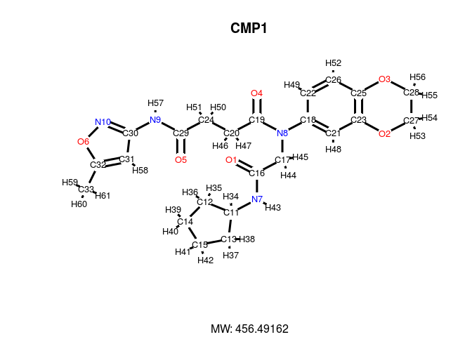
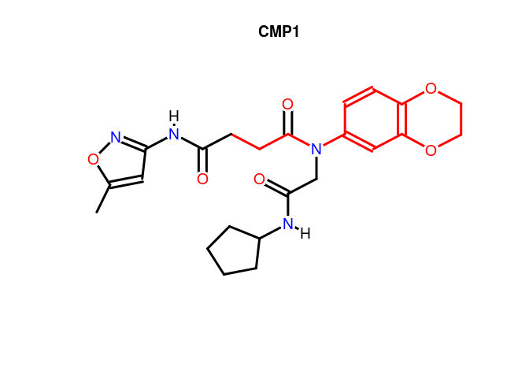

## R Graphics Device

A new plotting function for compound structures has been added to the
package recently. This function uses the native R graphics device for
generating compound depictions. At this point this function is still in
an experimental developmental stage but should become stable soon.  

If you have `ChemmineOB` available you can use the `regenCoords`
option to have OpenBabel regenerate the coordinates for the compound.
This can sometimes produce better looking plots.

Plot compound Structures with R's graphics device: 


 data(sdfsample)
 sdfset <- sdfsample
 plot(sdfset[1:4], regenCoords=TRUE,print=FALSE) # 'print=TRUE' returns SDF summaries


Customized plots: 


 plot(sdfset[1:4], griddim=c(2,2), print_cid=letters[1:4], print=FALSE, 
		noHbonds=FALSE) 


In the following plot, the atom block position numbers in the SDF are
printed next to the atom symbols (`atomnum = TRUE`). For
more details, consult help documentation with
`?plotStruc` or `?plot`. 


 plot(sdfset["CMP1"], atomnum = TRUE, noHbonds=F , no_print_atoms = "",
	  	atomcex=0.8, sub=paste("MW:", MW(sdfsample["CMP1"])), print=FALSE) 


Substructure highlighting by atom numbers: 


 plot(sdfset[1], print=FALSE, colbonds=c(22,26,25,3,28,27,2,23,21,18,8,19,20,24)) 


## Online with ChemMine Tools

Alternatively, one can visualize compound structures with a standard web
browser using the online ChemMine Tools service.

Plot structures using web service ChemMine Tools: 


 sdf.visualize(sdfset[1:4]) 


