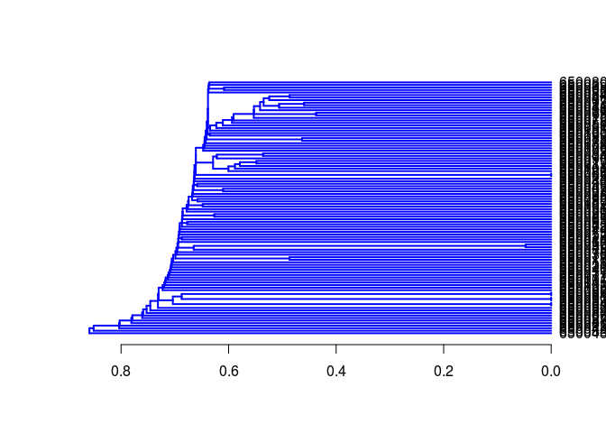

## Clustering Identical or Very Similar Compounds

Often it is of interest to identify very similar or identical compounds
in a compound set. The `cmp.duplicated` function can be
used to quickly identify very similar compounds in atom pair sets, which
will be frequently, but not necessarily, identical compounds.  

Identify compounds with identical AP sets: 


 cmp.duplicated(apset, type=1)[1:4] # Returns AP duplicates as logical vector 



## [1] FALSE FALSE FALSE FALSE



 cmp.duplicated(apset, type=2)[1:4,] # Returns AP duplicates as data frame 



##      ids CLSZ_100 CLID_100
## 1 650082        1        1
## 2 650059        2        2
## 3 650060        2        2
## 4 650010        1        3


Plot the structure of two pairs of duplicates: 


 plot(sdfset[c("650059","650060", "650065", "650066")], print=FALSE) 


Remove AP duplicates from SDFset and APset objects: 


 apdups <- cmp.duplicated(apset, type=1)
 sdfset[which(!apdups)]; apset[which(!apdups)] 



## An instance of "SDFset" with 96 molecules



## An instance of "APset" with 96 molecules


Alternatively, one can identify duplicates via other descriptor types if
they are provided in the data block of an imported SD file. For
instance, one can use here fingerprints, InChI, SMILES or other
molecular representations. The following examples show how to enumerate
by identical InChI strings, SMILES strings and molecular formula,
respectively.


 count <- table(datablocktag(sdfset,
 tag="PUBCHEM_NIST_INCHI"))
 count <- table(datablocktag(sdfset, tag="PUBCHEM_OPENEYE_CAN_SMILES")) 
 count <- table(datablocktag(sdfset, tag="PUBCHEM_MOLECULAR_FORMULA")) 
 count[1:4] 



## 
##  C10H9FN2O2S   C11H12N4OS    C11H13NO4 C12H11ClN2OS 
##            1            1            1            1


## Binning Clustering

Compound libraries can be clustered into discrete similarity groups with
the binning clustering function `cmp.cluster`. The
function accepts as input an atom pair (`APset`) or a
fingerprint (`FPset`) descriptor database as well as a
similarity threshold. The binning clustering result is returned in form
of a data frame. Single linkage is used for cluster joining. The
function calculates the required compound-to-compound distance
information on the fly, while a memory-intensive distance matrix is only
created upon user request via the `save.distances`
argument (see below).

Because an optimum similarity threshold is often not known, the
`cmp.cluster` function can calculate cluster results for
multiple cutoffs in one step with almost the same speed as for a single
cutoff. This can be achieved by providing several cutoffs under the
cutoff argument. The clustering results for the different cutoffs will
be stored in one data frame.

One may force the `cmp.cluster` function to calculate and
store the distance matrix by supplying a file name to the
`save.distances` argument. The generated distance matrix
can be loaded and passed on to many other clustering methods available
in R, such as the hierarchical clustering function
`hclust` (see below).

If a distance matrix is available, it may also be supplied to
`cmp.cluster` via the `use.distances`
argument. This is useful when one has a pre-computed distance matrix
either from a previous call to `cmp.cluster` or from
other distance calculation subroutines.  

Single-linkage binning clustering with one or multiple cutoffs:


 clusters <- cmp.cluster(db=apset, cutoff = c(0.7, 0.8, 0.9), quiet = TRUE)



## 
## sorting result...



 clusters[1:12,] 



##       ids CLSZ_0.7 CLID_0.7 CLSZ_0.8 CLID_0.8 CLSZ_0.9 CLID_0.9
## 48 650049        2       48        2       48        2       48
## 49 650050        2       48        2       48        2       48
## 54 650059        2       54        2       54        2       54
## 55 650060        2       54        2       54        2       54
## 56 650061        2       56        2       56        2       56
## 57 650062        2       56        2       56        2       56
## 58 650063        2       58        2       58        2       58
## 59 650064        2       58        2       58        2       58
## 60 650065        2       60        2       60        2       60
## 61 650066        2       60        2       60        2       60
## 1  650001        1        1        1        1        1        1
## 2  650002        1        2        1        2        1        2


Clustering of `FPset` objects with multiple cutoffs. This
method allows to call various similarity methods provided by the
`fpSim` function. For details consult
`?fpSim`. 


 fpset <- desc2fp(apset)
 clusters2 <- cmp.cluster(fpset, cutoff=c(0.5, 0.7, 0.9), method="Tanimoto", quiet=TRUE)



## 
## sorting result...



 clusters2[1:12,] 



##       ids CLSZ_0.5 CLID_0.5 CLSZ_0.7 CLID_0.7 CLSZ_0.9 CLID_0.9
## 69 650074       14       11        2       69        1       69
## 79 650085       14       11        2       69        1       79
## 11 650011       14       11        1       11        1       11
## 15 650015       14       11        1       15        1       15
## 45 650046       14       11        1       45        1       45
## 47 650048       14       11        1       47        1       47
## 51 650054       14       11        1       51        1       51
## 53 650058       14       11        1       53        1       53
## 64 650069       14       11        1       64        1       64
## 65 650070       14       11        1       65        1       65
## 67 650072       14       11        1       67        1       67
## 86 650092       14       11        1       86        1       86


Sames as above, but using Tversky similarity measure: 


 clusters3 <- cmp.cluster(fpset, cutoff=c(0.5, 0.7, 0.9), 
								  method="Tversky", alpha=0.3, beta=0.7, quiet=TRUE) 



## 
## sorting result...


Return cluster size distributions for each cutoff: 


 cluster.sizestat(clusters, cluster.result=1)



##   cluster size count
## 1            1    90
## 2            2     5



 cluster.sizestat(clusters, cluster.result=2)



##   cluster size count
## 1            1    90
## 2            2     5



 cluster.sizestat(clusters, cluster.result=3) 



##   cluster size count
## 1            1    90
## 2            2     5


Enforce calculation of distance matrix: 


 clusters <- cmp.cluster(db=apset, cutoff = c(0.65, 0.5, 0.3),
 save.distances="distmat.rda") # Saves distance matrix to file "distmat.rda" in current working directory. 
 load("distmat.rda") # Loads distance matrix. 


## Jarvis-Patrick Clustering

The Jarvis-Patrick clustering algorithm is widely used in
cheminformatics [@greycite13371]. It requires a nearest neighbor table, which consists
of *j* nearest neighbors for each item (*e.g.* compound).
The nearest neighbor table is then used to join items into clusters when
they meet the following requirements: (a) they are contained in each
other's neighbor list and (b) they share at least *k*
nearest neighbors. The values for *j* and
*k* are user-defined parameters. The
`jarvisPatrick` function implemented in
`ChemmineR` takes a nearest neighbor table generated by
`nearestNeighbors`, which works for
`APset` and `FPset` objects. This function
takes either the standard Jarvis-Patrick *j* parameter
(as the `numNbrs` parameter), or else a
`cutoff` value, which is an extension to the basic
algorithm that we have added. Given a cutoff value, the nearest neighbor
table returned contains every neighbor with a similarity greater than
the cutoff value, for each item. This allows one to generate tighter
clusters and to minimize certain limitations of this method, such as
false joins of completely unrelated items when operating on small data
sets. The `trimNeighbors` function can also be used to
take an existing nearest neighbor table and remove all neighbors whose
similarity value is below a given cutoff value. This allows one to
compute a very relaxed nearest neighbor table initially, and then
quickly try different refinements later.

In case an existing nearest neighbor matrix needs to be used, the
`fromNNMatrix` function can be used to transform it into
the list structure that `jarvisPatrick` requires. The
input matrix must have a row for each compound, and each row should be
the index values of the neighbors of compound represented by that row.
The names of each compound can also be given through the
`names` argument. If not given, it will attempt to use
the `rownames` of the given matrix.

The `jarvisPatrick` function also allows one to relax
some of the requirements of the algorithm through the
`mode` parameter. When set to "a1a2b", then all
requirements are used. If set to "a1b", then (a) is relaxed to a
unidirectional requirement. Lastly, if `mode` is set to
"b", then only requirement (b) is used, which means that all pairs of
items will be checked to see if (b) is satisfied between them. The size
of the clusters generated by the different methods increases in this
order: "a1a2b" < "a1b" < "b". The run time of method "a1a2b" follows a
close to linear relationship, while it is nearly quadratic for the much
more exhaustive method "b". Only methods "a1a2b" and "a1b" are suitable
for clustering very large data sets (e.g. \>50,000 items) in a
reasonable amount of time.

An additional extension to the algorithm is the ability to set the
linkage mode. The `linkage` parameter can be one of
"single", "average", or "complete", for single linkage, average linkage
and complete linkage merge requirements, respectively. In the context of
Jarvis-Patrick, average linkage means that at least half of the pairs
between the clusters under consideration must meet requirement (b).
Similarly, for complete linkage, all pairs must requirement (b). Single
linkage is the normal case for Jarvis-Patrick and just means that at
least one pair must meet requirement (b).

The output is a cluster `vector` with the item labels in
the name slot and the cluster IDs in the data slot. There is a utility
function called `byCluster`, which takes out cluster
vector output by `jarvisPatrick` and transforms it into a
list of vectors. Each slot of the list is named with a cluster id and
the vector contains the cluster members. By default the function
excludes singletons from the output, but they can be included by setting
`excludeSingletons`=FALSE`.

Load/create sample `APset` and `FPset`:


 data(apset) 
 fpset <- desc2fp(apset) 


Standard Jarvis-Patrick clustering on `APset` and
`FPset` objects: 


 jarvisPatrick(nearestNeighbors(apset,numNbrs=6), k=5, mode="a1a2b")



## 650001 650002 650003 650004 650005 650006 650007 650008 650009 650010 650011 650012 650013 650014 
##      1      2      3      4      5      6      7      8      9     10     11     12     13     14 
## 650015 650016 650017 650019 650020 650021 650022 650023 650024 650025 650026 650027 650028 650029 
##     11     15     16     17     18     19     20     21     22     23     24     25     26     27 
## 650030 650031 650032 650033 650034 650035 650036 650037 650038 650039 650040 650041 650042 650043 
##     28     29     30     31     32     33     34     35     36     37     38     39     40     41 
## 650044 650045 650046 650047 650048 650049 650050 650052 650054 650056 650058 650059 650060 650061 
##     42     43     44     45     46     47     48     49     50     51     52     53     54     55 
## 650062 650063 650064 650065 650066 650067 650068 650069 650070 650071 650072 650073 650074 650075 
##     56     57     58     59     60     61     62     63     64     65     66     67     68     69 
## 650076 650077 650078 650079 650080 650081 650082 650083 650085 650086 650087 650088 650089 650090 
##     70     71     72     73     74     75     76     77     78     79     80     81     82     83 
## 650091 650092 650093 650094 650095 650096 650097 650098 650099 650100 650101 650102 650103 650104 
##     84     85     86     87     88     89     90     91     92     93     94     95     96     97 
## 650105 650106 
##     98     99



 #Using "APset" 

 jarvisPatrick(nearestNeighbors(fpset,numNbrs=6), k=5, mode="a1a2b")



## 650001 650002 650003 650004 650005 650006 650007 650008 650009 650010 650011 650012 650013 650014 
##      1      2      3      4      5      6      7      8      9     10     11     12     13     14 
## 650015 650016 650017 650019 650020 650021 650022 650023 650024 650025 650026 650027 650028 650029 
##     11     15     16     17     18     19     20     21     22     23     24     25     26     27 
## 650030 650031 650032 650033 650034 650035 650036 650037 650038 650039 650040 650041 650042 650043 
##     28     29     30     31     32     33     34     35     36     37     38     39     40     41 
## 650044 650045 650046 650047 650048 650049 650050 650052 650054 650056 650058 650059 650060 650061 
##     42     43     44     45     46     47     48     49     50     51     52     53     54     55 
## 650062 650063 650064 650065 650066 650067 650068 650069 650070 650071 650072 650073 650074 650075 
##     56     57     58     59     60     61     62     63     64     65     66     67     68     69 
## 650076 650077 650078 650079 650080 650081 650082 650083 650085 650086 650087 650088 650089 650090 
##     70     71     72     73     74     75     76     77     78     79     80     81     82     83 
## 650091 650092 650093 650094 650095 650096 650097 650098 650099 650100 650101 650102 650103 650104 
##     84     85     86     87     88     89     90     91     92     93     94      1     95     96 
## 650105 650106 
##     97     98



 #Using "FPset" 


The following example runs Jarvis-Patrick clustering with a minimum
similarity `cutoff` value (here Tanimoto coefficient). In
addition, it uses the much more exhaustive `"b"` method
that generates larger cluster sizes, but significantly increased the run
time. For more details, consult the corresponding help file with
`?jarvisPatrick`. 


 cl<-jarvisPatrick(nearestNeighbors(fpset,cutoff=0.6,
 method="Tanimoto"), k=2 ,mode="b")
 byCluster(cl) 



## $`11`
## [1] "650011" "650092"
## 
## $`15`
## [1] "650015" "650069"
## 
## $`45`
## [1] "650046" "650054"
## 
## $`48`
## [1] "650049" "650050"
## 
## $`52`
## [1] "650059" "650060"
## 
## $`53`
## [1] "650061" "650062"
## 
## $`54`
## [1] "650063" "650064"
## 
## $`55`
## [1] "650065" "650066"
## 
## $`62`
## [1] "650074" "650085"


Output nearest neighbor table (`matrix`): 


 nnm <- nearestNeighbors(fpset,numNbrs=6)
 nnm$names[1:4] 



## [1] "650001" "650002" "650003" "650004"



 nnm$ids[1:4,] 



## NULL



 nnm$similarities[1:4,] 



##     650001    650102    650072    650015    650094    650069
## sim      1 0.4719101 0.4288499 0.4275229 0.4247423 0.4187380
## sim      1 0.4343891 0.4246575 0.4216867 0.3939394 0.3922078
## sim      1 0.4152249 0.3619303 0.3610315 0.3424242 0.3367089
## sim      1 0.5791045 0.4973958 0.4192708 0.4166667 0.4104683


Trim nearest neighbor table: 


 nnm <- trimNeighbors(nnm,cutoff=0.4) 
 nnm$similarities[1:4,]



##     650001    650102    650072    650015    650094    650069
## sim      1 0.4719101 0.4288499 0.4275229 0.4247423 0.4187380
## sim      1 0.4343891 0.4246575 0.4216867        NA        NA
## sim      1 0.4152249        NA        NA        NA        NA
## sim      1 0.5791045 0.4973958 0.4192708 0.4166667 0.4104683


Perform clustering on precomputed nearest neighbor table: 


 jarvisPatrick(nnm, k=5,mode="b") 



## 650001 650002 650003 650004 650005 650006 650007 650008 650009 650010 650011 650012 650013 650014 
##      1      2      3      4      5      6      7      8      9     10     11     12     13     14 
## 650015 650016 650017 650019 650020 650021 650022 650023 650024 650025 650026 650027 650028 650029 
##     11     15     16     17     18     19     20     21     22     23     24     25     26     27 
## 650030 650031 650032 650033 650034 650035 650036 650037 650038 650039 650040 650041 650042 650043 
##     28     29     30     31     32     33     34     35     36     37     38     39     40     41 
## 650044 650045 650046 650047 650048 650049 650050 650052 650054 650056 650058 650059 650060 650061 
##     42     43     11     44     11     45     46     47     48     49     50     51     52     53 
## 650062 650063 650064 650065 650066 650067 650068 650069 650070 650071 650072 650073 650074 650075 
##     54     55     56     57     57     58     59     11     60     61     62     63     64     65 
## 650076 650077 650078 650079 650080 650081 650082 650083 650085 650086 650087 650088 650089 650090 
##     66     67     68     69     37     70     71     72     64     73     74     75     76     77 
## 650091 650092 650093 650094 650095 650096 650097 650098 650099 650100 650101 650102 650103 650104 
##     78     11     79     80     81     82     83     84     85     86     87      1     88     89 
## 650105 650106 
##     90     91


Using a user defined nearest neighbor matrix: 


 nn <- matrix(c(1,2,2,1),2,2,dimnames=list(c('one','two'))) 
 nn



##     [,1] [,2]
## one    1    2
## two    2    1



 byCluster(jarvisPatrick(fromNNMatrix(nn),k=1)) 



## $`1`
## [1] "one" "two"


## Multi-Dimensional Scaling (MDS)

To visualize and compare clustering results, the
`cluster.visualize` function can be used. The function
performs Multi-Dimensional Scaling (MDS) and visualizes the results in
form of a scatter plot. It requires as input an `APset`,
a clustering result from `cmp.cluster`, and a cutoff for
the minimum cluster size to consider in the plot. To help determining a
proper cutoff size, the `cluster.sizestat` function is
provided to generate cluster size statistics.

MDS clustering and scatter plot: 


 cluster.visualize(apset, clusters, size.cutoff=2, quiet = TRUE) # Color codes clusters with at least two members. 
 cluster.visualize(apset, clusters, quiet = TRUE) # Plots all items.


Create a 3D scatter plot of MDS result: 


 library(scatterplot3d) 
 coord <- cluster.visualize(apset, clusters, size.cutoff=1, dimensions=3, quiet=TRUE) 
 scatterplot3d(coord) 


Interactive 3D scatter plot with Open GL (graphics not evaluated here):


 library(rgl) rgl.open(); offset <- 50;
 par3d(windowRect=c(offset, offset, 640+offset, 640+offset)) 
 rm(offset)
 rgl.clear() 
 rgl.viewpoint(theta=45, phi=30, fov=60, zoom=1)
 spheres3d(coord[,1], coord[,2], coord[,3], radius=0.03, color=coord[,4], alpha=1, shininess=20) 
 aspect3d(1, 1, 1) 
 axes3d(col='black')
 title3d("", "", "", "", "", col='black')
 bg3d("white") # To save a snapshot of the graph, one can use the command rgl.snapshot("test.png").


## Clustering with Other Algorithms

`ChemmineR` allows the user to take advantage of the wide
spectrum of clustering utilities available in R. An example on how to
perform hierarchical clustering with the hclust function is given
below.  

Create atom pair distance matrix:


 dummy <- cmp.cluster(db=apset, cutoff=0, save.distances="distmat.rda", quiet=TRUE) 



## 
## sorting result...



 load("distmat.rda") 


Hierarchical clustering with `hclust`: 


 hc <- hclust(as.dist(distmat), method="single") 
 hc[["labels"]] <- cid(apset) # Assign correct item labels 
 plot(as.dendrogram(hc), edgePar=list(col=4, lwd=2), horiz=T) 


Instead of atom pairs one can use PubChem's fingerprints for clustering:


 simMA <- sapply(cid(fpset), function(x) fpSim(fpset[x], fpset, sorted=FALSE))
 hc <- hclust(as.dist(1-simMA), method="single") 
 plot(as.dendrogram(hc), edgePar=list(col=4, lwd=2), horiz=TRUE) 


Plot dendrogram with heatmap (here similarity matrix): 


 library(gplots) 



## 
## Attaching package: 'gplots'



## The following object is masked from 'package:stats':
## 
##     lowess



 heatmap.2(1-distmat, Rowv=as.dendrogram(hc), Colv=as.dendrogram(hc), 
			  col=colorpanel(40, "darkblue", "yellow", "white"), 
			  density.info="none", trace="none") 


