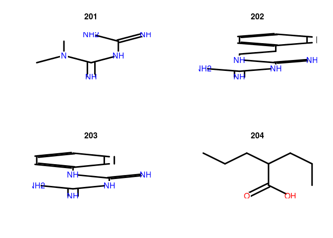

## Retrieve compound structures


results <- getAllCompoundIds(conn)
sdfset <- getCompounds(conn, results, keepOrder=TRUE)
sdfset



## An instance of "SDFset" with 1309 molecules



plot(sdfset[1:4], print=FALSE)



as.data.frame(datablock2ma(datablock(sdfset)))[1:4,]



##     instance_id batch_id        cmap_name INN1 concentration..M. duration..h. cell2   array3
## 201           1        1        metformin  INN          1.00e-05            6  MCF7 HG-U133A
## 202          21        2       phenformin  INN          1.00e-05            6  MCF7 HG-U133A
## 203          22        2 phenyl biguanide               1.00e-05            6  MCF7 HG-U133A
## 204          23        2    valproic acid  INN          1.00e-03            6  MCF7 HG-U133A
##     perturbation_scan_id vehicle_scan_id4              scanner vehicle        vendor catalog_number
## 201       EC2003090503AA   EC2003090502AA HP GeneArray Scanner  medium Sigma-Aldrich          D5035
## 202       EC2003091104AA   EC2003091102AA HP GeneArray Scanner  medium Sigma-Aldrich          P7045
## 203       EC2003091105AA   EC2003091102AA HP GeneArray Scanner  medium Sigma-Aldrich         P19906
## 204       EC2003091106AA   EC2003091102AA HP GeneArray Scanner  medium Sigma-Aldrich          P4543
##                            catalog_name      SOURCE_DRUG     UNIPROT       P_SCORE DIRECTIONALITY
## 201 1,1-dimethylbiguanide hydrochloride        Metformin ZN396_HUMAN    1.53601286    Stimulatory
## 202            phenformin hydrochloride       Phenformin KI2L3_HUMAN   -6.33081681     Inhibitory
## 203     1-phenylbiguanide hydrochloride PHENYL BIGUANIDE  RHOC_HUMAN   -4.21084571     Inhibitory
## 204              2-propylpentanoic acid    Valproic Acid GSK3B_HUMAN  -58.47057966     Inhibitory
##     PUBCHEM_ID DRUGBANK_ID           DRUGBANK_GROUP        ATCCODES chembank_id   chembank_name
## 201    CID4091     DB00331                 approved A10BD11|A10BA02        1714       metformin
## 202    CID8249     DB00914       approved|withdrawn         A10BA01     1018627      phenformin
## 203    CID4780                                                            32656 phenylbiguanide
## 204    CID3121     DB00313 approved|investigational         N03AG01         471   valproic acid
##     match_distance                  smiles
## 201              0       CN(C)C(=N)NC(=N)N
## 202              0 NC(=N)NC(=N)NCCc1ccccc1
## 203              0   NC(=N)NC(=N)Nc1ccccc1
## 204              0         CCCC(CCC)C(=O)O


## Retrieve compound properties


myfeat <- listFeatures(conn)
feat <- getCompoundFeatures(conn, results, myfeat)
feat[1:4,]



##   compound_id aromatic                  cansmi                cansmins  formula hba1 hba2 hbd
## 1         201        0       CN(C(=N)NC(=N)N)C       CN(C(=N)NC(=N)N)C  C4H11N5    5    5   4
## 2         202        1 N=C(NC(=N)N)NCCc1ccccc1 N=C(NC(=N)N)NCCc1ccccc1 C10H15N5    5    5   5
## 3         203        1   N=C(Nc1ccccc1)NC(=N)N   N=C(Nc1ccccc1)NC(=N)N  C8H11N5    5    5   5
## 4         204        0         CCCC(C(=O)O)CCC         CCCC(C(=O)O)CCC  C8H16O2    2    2   1
##                                                                                      inchi   logp
## 1                                  InChI=1S/C4H11N5/c1-9(2)4(7)8-3(5)6/h1-2H3,(H5,5,6,7,8) 0.2565
## 2 InChI=1S/C10H15N5/c11-9(12)15-10(13)14-7-6-8-4-2-1-3-5-8/h1-5H,6-7H2,(H6,11,12,13,14,15) 1.9181
## 3               InChI=1S/C8H11N5/c9-7(10)13-8(11)12-6-4-2-1-3-5-6/h1-5H,(H6,9,10,11,12,13) 1.8800
## 4                          InChI=1S/C8H16O2/c1-3-5-7(6-4-2)8(9)10/h7H,3-6H2,1-2H3,(H,9,10) 2.2874
##        mr       mw ncharges nf r2nh r3n rcch rcho rcn rcooh rcoor rcor rings rnh2 roh ropo3 ror
## 1 36.9285 129.1636        0  0    1   1    0    0   0     0     0    0     0    0   0     0   0
## 2 61.3212 205.2596        0  0    2   0    0    0   0     0     0    0     1    0   0     0   0
## 3 53.2452 177.2064        0  0    2   0    0    0   0     0     0    0     1    0   0     0   0
## 4 42.3418 144.2114        0  0    0   0    0    0   0     1     0    0     0    0   0     0   0
##              title  tpsa
## 1        metformin 88.99
## 2       phenformin 97.78
## 3 phenyl biguanide 97.78
## 4    valproic acid 37.30


