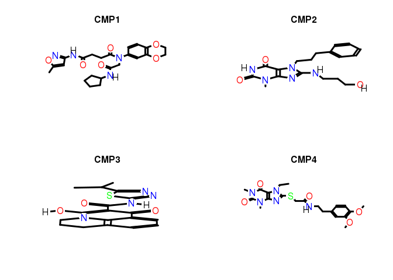

## Generate list of CEL names defining treatment vs. control comparisons

The `sampleList` function extracts the sample comparisons (contrasts) from the
CMAP annotation table and stores them as a list.


cmap <- read.delim("./data/cmap_instances_02.txt", check.names=FALSE) 
# comp_list <- sampleList(cmap, myby="CMP")
comp_list <- sampleList(cmap, myby="CMP_CELL")


## Load normalized expression data 

The following loads the MAS5 normalized expression data into a single `data.frame`. 
To accelerate the import, the data is read from `rds` files. 


chiptype_dir <- unique(readRDS("./data/chiptype.rds"))
df1 <- readRDS(paste0("data/", chiptype_dir[1], "/", "all_mas5exprs.rds"))
df2 <- readRDS(paste0("data/", chiptype_dir[2], "/", "all_mas5exprs.rds"))
df3 <- readRDS(paste0("data/", chiptype_dir[3], "/", "all_mas5exprs.rds"))
affyid <- rownames(df1)[rownames(df1) %in% rownames(df2)]; affyid <- affyid[affyid %in% rownames(df3)]
mas5df <- cbind(df1[affyid,], df2[affyid,], df3[affyid,])


## Transform probe set to gene level data
The next step generates gene level expression values. If genes are represented by several
probe sets then their mean intensities are used. This is necessary because 
the U133 chip contains many genes with duplicated probe sets. Probe sets not matching 
any gene are removed.


myAnnot <- readRDS("./results/myAnnot.rds") 
myAnnot <- myAnnot[as.character(myAnnot[,"ENTREZID"]) != "NA",]
mas5df <- mas5df[rownames(myAnnot),]
idlist <- tapply(row.names(myAnnot), as.character(myAnnot$ENTREZID), c)
mas5df <- t(sapply(names(idlist), function(x) colMeans(mas5df[idlist[[x]], ])))


## DEG analysis with `limma`

The analysis of differentially expressed genes (DEGs) is performed with the `limma` package.
Genes meeting the chosen cutoff criteria are reported as DEGs (below set to FDR of 10% and 
a minimum fold change of 2). The DEG matrix is written to a file named 
[`degMA.xls`](http://biocluster.ucr.edu/~tgirke/projects/longevity/cmap/results/degMA.xls).


degList <- runLimma(df=log2(mas5df), comp_list, fdr=0.10, foldchange=1, verbose=TRUE, affyid=NULL)
write.table(degList$DEG, file="./results/degMA.xls", quote=FALSE, sep="\t", col.names = NA) 
saveRDS(degList$DEG, "./results/degMA.rds") # saves binary matrix 
saveRDS(degList, "./results/degList.rds") # saves entire degList


<!-- Not neceassary anymore since intensities of genes with multiple probe sets are averaged
## Transform probe set to gene level data

The `probeset2gene` function translates a binary DEG matrix from the probe level (`row.names` are
Affy IDs) to the gene level (`row.names` are gene IDs). Genes represented by several probe
sets (rows) will be collapsed based on a chosen summary rule. The following summary rules are
supported: `summary_rule=1L` will consider a gene as a DEG for a specific treatment if at 
least one of several probe sets supports this assignment, while `summary_rule=2L` requires 
support from at least 2 probe sets.


myAnnot <- readRDS("./results/myAnnot.rds") 
degMA <- readRDS("./results/degMA.rds") # Faster than read.delim()
degMAgene <- probeset2gene(degMA, myAnnot, geneIDtype="ENTREZID", summary_rule=1L)
saveRDS(degMAgene, "./results/degMAgene.rds")

--> 

## Number of DEGs across drug treatments

The following plots the number of drug treatments (y-axis) for increasing bin sizes (x-axis) 
of DEGs. 


degMAgene <- readRDS("./results/degMA.rds")
y <- as.numeric(colSums(degMAgene))
interval <- table(cut(y, right=FALSE, dig.lab=5,  breaks=c(0, 5, 10, 50, 100, 200, 500, 1000, 10000)))
df <- data.frame(interval); colnames(df) <- c("Bins", "Counts")
ggplot(df, aes(Bins, Counts)) + 
       geom_bar(position="dodge", stat="identity", fill="cornflowerblue") + 
       ggtitle("DEG numbers by bins")


## Identify DEG overlaps with Peters et al. (2015)

Peters et al. (2015) reported 1,497 age-related gene expression
signatures.  The `intersectStats` function computes their intersects with each
of the 3,318 drug-responsive DEG sets from CMAP. The result includes the
Jaccard index as a simple similarity metric for gene sets as well as the raw
and adjusted p-values based on the hypergeometric distribution expressing how
likely it is to obtain the observed intersect sizes just by chance. The
results for the 20 top scoring drugs are given below and the full data set is
written to a file named
[`degOL_PMID26490707.xls`](http://biocluster.ucr.edu/~tgirke/projects/longevity/cmap/results/degOL_PMID26490707.xls).


PMID26490707 <- read.delim("./data/PMID26490707_S1.xls", comment="#")
myAnnot <- readRDS("./results/myAnnot.rds") 
geneid <- as.character(PMID26490707$"NEW.Entrez.ID")
degMAgene <- readRDS("./results/degMA.rds") # Faster than read.delim()
degMAsub <- degMAgene[rownames(degMAgene) %in% geneid,]
degOL_PMID26490707 <- intersectStats(degMAgene, degMAsub)
write.table(degOL_PMID26490707, file="./results/degOL_PMID26490707.xls", quote=FALSE, sep="\t", col.names = NA) 
sum(degOL_PMID26490707[,1] > 0) # Drugs with any overlap



## [1] 1137



degOL_PMID26490707[1:20,]



##                                Jaccard_Index longevity_DEG cmap_DEG Intersect         Pval
## alprostadil_HL60                  0.10272537          1192      912       196 1.706881e-29
## dihydroergotamine_HL60            0.06187625          1192      404        93 3.698500e-16
## pergolide_HL60                    0.07815080          1192      767       142 2.631561e-15
## (-)-isoprenaline_HL60             0.05113636          1192      288        72 1.087773e-14
## Prestwick-983_HL60                0.05948447          1192      411        90 2.785586e-14
## nocodazole_HL60                   0.06384324          1192      491       101 4.863951e-14
## anisomycin_HL60                   0.09790419          1192     2475       327 2.312553e-11
## tetryzoline_HL60                  0.03366488          1192      159        44 4.993036e-11
## mebendazole_HL60                  0.06041924          1192      528        98 6.663275e-11
## methylergometrine_HL60            0.04436620          1192      291        63 3.825164e-10
## lycorine_HL60                     0.09093994          1192     2023       268 2.411922e-09
## podophyllotoxin_HL60              0.04175513          1192      280        59 4.108204e-09
## colchicine_HL60                   0.03181818          1192      170        42 5.960591e-09
## co-dergocrine mesilate_HL60       0.05239617          1192      455        82 1.062344e-08
## puromycin_HL60                    0.05060858          1192      448        79 5.282895e-08
## tretinoin_HL60                    0.03738318          1192      251        52 6.182212e-08
## 15-delta prostaglandin J2_HL60    0.04560698          1192      367        68 6.583181e-08
## geldanamycin_HL60                 0.03068862          1192      185        41 2.331048e-07
## bromocriptine_HL60                0.02739726          1192      158        36 6.194257e-07
## apigenin_HL60                     0.06292967          1192      818       119 1.601978e-06
##                                    adj_Pval
## alprostadil_HL60               5.936533e-26
## dihydroergotamine_HL60         1.286338e-12
## pergolide_HL60                 9.152569e-12
## (-)-isoprenaline_HL60          3.783276e-11
## Prestwick-983_HL60             9.688270e-11
## nocodazole_HL60                1.691682e-10
## anisomycin_HL60                8.043059e-08
## tetryzoline_HL60               1.736578e-07
## mebendazole_HL60               2.317487e-07
## methylergometrine_HL60         1.330392e-06
## lycorine_HL60                  8.388664e-06
## podophyllotoxin_HL60           1.428833e-05
## colchicine_HL60                2.073093e-05
## co-dergocrine mesilate_HL60    3.694832e-05
## puromycin_HL60                 1.837391e-04
## tretinoin_HL60                 2.150173e-04
## 15-delta prostaglandin J2_HL60 2.289630e-04
## geldanamycin_HL60              8.107384e-04
## bromocriptine_HL60             2.154363e-03
## apigenin_HL60                  5.571679e-03


## Identify DEG overlaps with Sood et al. (2015)

Sood et al. (2015) reported 150 age-related gene expression signatures. 
The `intersectStats` function computes their intersects with each of the 3,318 
drug-responsive DEG sets from CMAP. The result includes the Jaccard index as a simple 
similarity metric for gene sets as well as the raw and adjusted p-values based on the 
hypergeometric distribution expressing how likely it is to observe the observed intersect 
sizes just by chance. The results for the 20 top scoring drugs are given below and the full
data set is written to a file named [`degOL_PMID26343147.xls`](http://biocluster.ucr.edu/~tgirke/projects/longevity/cmap/results/degOL_PMID26343147.xls).


PMID26343147 <- read.delim("./data/PMID26343147_S1T1.xls", check.names=FALSE, comment="#")
myAnnot <- readRDS("./results/myAnnot.rds") 
geneid <- as.character(myAnnot[rownames(myAnnot) %in% as.character(PMID26343147[,1]), "ENTREZID"])
geneid <- geneid[geneid!="NA"]
degMA <- readRDS("./results/degMA.rds") # Faster then read.delim()
degMA <- degMA[ , !is.na(colSums(degMA))] # Remove columns where DEG analysis was not possible
degMAsub <- degMA[geneid,]
degOL_PMID26343147 <- intersectStats(degMAgene, degMAsub)
write.table(degOL_PMID26343147, file="./results/degOL_PMID26343147.xls", quote=FALSE, sep="\t", col.names = NA) 
sum(degOL_PMID26343147[,1] > 0) # Drugs with any overlap



## [1] 223



degOL_PMID26343147[1:20,] # Top 20 scoring drugs



##                        Jaccard_Index longevity_DEG cmap_DEG Intersect        Pval adj_Pval
## colecalciferol_MCF7      0.017857143            55        2         1 0.008821835        1
## esculin_HL60             0.017857143            55        2         1 0.008821835        1
## flecainide_MCF7          0.017857143            55        2         1 0.008821835        1
## ribostamycin_MCF7        0.017857143            55        2         1 0.008821835        1
## withaferin A_MCF7        0.016000000            55      199         4 0.011470972        1
## dexamethasone_HL60       0.022222222            55       37         2 0.011573654        1
## lobeline_HL60            0.007987220            55     1838        15 0.011600566        1
## idoxuridine_MCF7         0.017543860            55        3         1 0.013204054        1
## metronidazole_MCF7       0.017543860            55        3         1 0.013204054        1
## sulpiride_MCF7           0.017543860            55        3         1 0.013204054        1
## ampyrone_HL60            0.008880995            55     1081        10 0.018769135        1
## chlortetracycline_HL60   0.008080808            55     1442        12 0.021597597        1
## estropipate_MCF7         0.016949153            55        5         1 0.021911500        1
## flunixin_PC3             0.016949153            55        5         1 0.021911500        1
## sulfafurazole_HL60       0.018867925            55       53         2 0.022894704        1
## (-)-MK-801_MCF7          0.016666667            55        6         1 0.026236889        1
## carbarsone_PC3           0.016666667            55        6         1 0.026236889        1
## famprofazone_HL60        0.016666667            55        6         1 0.026236889        1
## guanethidine_HL60        0.016666667            55        6         1 0.026236889        1
## cefalotin_MCF7           0.016393443            55        7         1 0.030543497        1


## Drugs affecting known longevity genes

The following identifies CMAP drugs affecting the expression of the IGF1 or IGF1R genes.
The final result is written to a file named [`deg_IGF1.xls`](http://biocluster.ucr.edu/~tgirke/projects/longevity/cmap/results/deg_IGF1.xls).


genesymbols <- c("IGF1", "IGF1R")
geneids <- unique(as.character(myAnnot[myAnnot$SYMBOL %in% genesymbols,"ENTREZID"]))
names(geneids) <- unique(as.character(myAnnot[myAnnot$SYMBOL %in% genesymbols,"SYMBOL"]))
degList <- readRDS("./results/degList.rds") 
df <- data.frame(row.names=colnames(degList$DEG), check.names=FALSE)
index <- which(colSums(degList$DEG[geneids,])>= 1) 
for(i in seq_along(geneids)) {
    tmp <- data.frame(DEG=degList$DEG[geneids[i],index], logFC=degList$logFC[geneids[i],index], FDR=degList$FDR[geneids[i],index])
    colnames(tmp) <- paste0(names(geneids)[i], "_", colnames(tmp))
    df <- cbind(df, tmp[rownames(df),] )    
}
df <- df[names(index),]
write.table(df, file="./results/deg_IGF1.xls", quote=FALSE, sep="\t", col.names = NA) 


Now the final `data.frame` can be sorted by increasing mean FDR values. 


igfDF <- read.delim("./results/deg_IGF1.xls", row.names=1)
igfDF[order(rowMeans(igfDF[,c(3,6)])),][1:20,]



##                                IGF1R_DEG IGF1R_logFC     IGF1R_FDR IGF1_DEG  IGF1_logFC   IGF1_FDR
## camptothecin_MCF7                      1 -1.48180690  4.867357e-07        0  0.94295576 0.07821138
## 0175029-0000_MCF7                      0 -0.62026588  1.193479e-01        1 -1.01210916 0.04295254
## cicloheximide_HL60                     1 -1.29607754  2.054384e-02        0  1.67183429 0.16908728
## emetine_HL60                           1 -1.23843896  3.085463e-03        0  1.03812083 0.26576009
## digoxigenin_PC3                        0  0.54850849  2.488776e-01        1 -1.27142976 0.04219010
## anisomycin_HL60                        1 -2.85399433  1.481347e-03        0  0.66701644 0.44025263
## vorinostat_MCF7                        1 -1.50640830  3.143781e-17        0  0.37179771 0.45437384
## irinotecan_MCF7                        1 -2.26588384  9.895790e-02        0 -1.05446828 0.41746319
## tyrphostin AG-825_MCF7                 1 -1.03570748  3.440048e-02        0  1.57208567 0.51400841
## trichostatin A_MCF7                    1 -1.27541131 6.943847e-127        0  0.07335895 0.55046789
## baclofen_HL60                          1  1.14379132  8.226627e-02        0 -1.00641253 0.53322529
## 8-azaguanine_PC3                       1 -1.04668136  7.466879e-02        0 -0.97679589 0.65221001
## verteporfin_MCF7                       1 -1.11136304  1.226251e-03        0  0.64194152 0.78463681
## piperlongumine_MCF7                    1 -1.03214332  1.088011e-02        0  0.53820854 0.78914488
## verteporfin_HL60                       1 -1.17232840  4.923492e-02        0  1.09438523 0.75358370
## cephaeline_HL60                        1 -1.13448661  1.479635e-02        0 -0.19882135 0.86619935
## lycorine_HL60                          1 -1.93807396  1.390079e-03        0 -0.23062131 0.88748758
## doxorubicin_MCF7                       1 -1.08389932  4.035039e-04        0  0.12613722 0.92452703
## anisomycin_MCF7                        0  0.06265744  8.938603e-01        1 -1.55915713 0.04355888
## 15-delta prostaglandin J2_MCF7         0  0.01396391  9.774076e-01        1  1.03626957 0.09233156


<!-- old version


genesymbols <- c("IGF1", "IGF1R")
geneids <- unique(as.character(myAnnot[myAnnot$SYMBOL %in% genesymbols,"ENTREZID"]))
names(geneids) <- unique(as.character(myAnnot[myAnnot$SYMBOL %in% genesymbols,"SYMBOL"]))
degMAgene <- readRDS("./results/degMA.rds") # Faster than read.delim()
df <- data.frame(row.names=colnames(degMAgene), check.names=FALSE)
for(i in seq_along(geneids)) df <- cbind(df, as.numeric(degMAgene[geneids[i],]))
colnames(df) <- names(geneids)
df <- df[rowSums(df)>0,]
nrow(df) # Number of drugs affecting at least one of: IGF1 or IGF1R



## [1] 20


The following computes the `limma` FDR values for the corresponding genes (here IGF1 and IGF1R) 
and drug treatments.


affyids2 <- row.names(myAnnot[myAnnot$SYMBOL %in% genesymbols,])
affyids <- as.character(myAnnot[myAnnot$SYMBOL %in% genesymbols,"SYMBOL"])
names(affyids) <- affyids2
cmap <- read.delim("./data/cmap_instances_02.txt", check.names=FALSE) 
comp_list <- sampleList(cmap, myby="CMP_CELL")
comp_list <- comp_list[row.names(df)]
degList <- runLimma(df=mas5df, comp_list, fdr=0.10, foldchange=1, verbose=FALSE, affyid=names(affyids))
pvalDF <- sapply(unique(affyids), function(x) sapply(rownames(df), function(y) min(degList[[y]][affyids==x,"adj.P.Val"])))
colnames(pvalDF) <- paste0(colnames(pvalDF), "_FDR")
df <- cbind(df, pvalDF)
write.table(df, file="./results/deg_IGF1.xls", quote=FALSE, sep="\t", col.names = NA) 

--> 

## Plot structures of compounds


library(ChemmineR)
mypath <- system.file("extdata", "longevitydrugs.sdf", package="longevityTools")
mypath <- "../inst/extdata/longevitydrugs.sdf"
sdfset <- read.SDFset(mypath)
data(sdfsample)
sdfsample



## An instance of "SDFset" with 100 molecules



plot(sdfsample[1:4], print=FALSE)


