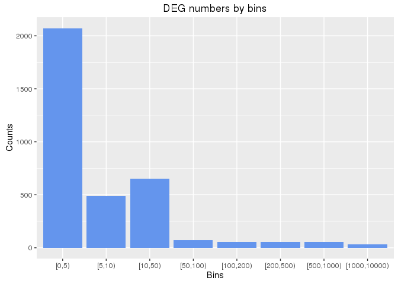

## Generate list of CEL names defining treatment vs. control comparisons

The `sampleList` function extracts the sample comparisons (contrasts) from the
CMAP annotation table and stores them as a list.


cmap <- read.delim("./data/cmap_instances_02.txt", check.names=FALSE) 
# comp_list <- sampleList(cmap, myby="CMP")
comp_list <- sampleList(cmap, myby="CMP_CELL")


## Load normalized expression data 

The following loads the MAS5 normalized expression data into a single `data.frame`. 
To accelerate the import, the data is read from `rds` files. 


chiptype_dir <- unique(readRDS("./data/chiptype.rds"))
df1 <- readRDS(paste0("data/", chiptype_dir[1], "/", "all_mas5exprs.rds"))
df2 <- readRDS(paste0("data/", chiptype_dir[2], "/", "all_mas5exprs.rds"))
df3 <- readRDS(paste0("data/", chiptype_dir[3], "/", "all_mas5exprs.rds"))
affyid <- rownames(df1)[rownames(df1) %in% rownames(df2)]; affyid <- affyid[affyid %in% rownames(df3)]
mas5df <- cbind(df1[affyid,], df2[affyid,], df3[affyid,])


## DEG analysis with `limma`

The analysis of differentially expressed genes (DEGs) is performed with the `limma` package.
Genes meeting the chosen cutoff criteria are reported as DEGs (below set to FDR of 10% and 
a minimum fold change of 2). The DEG matrix is written to a file named 
[`degMA.xls`](http://biocluster.ucr.edu/~tgirke/projects/longevity/cmap/results/degMA.xls).


degMA <- runLimma(df=mas5df, comp_list, fdr=0.10, foldchange=1, verbose=TRUE, affyid=NULL)
degMA <- degMA[ , !is.na(colSums(degMA))] # Remove columns where DEG analysis was not possible
write.table(degMA, file="./results/degMA.xls", quote=FALSE, sep="\t", col.names = NA) 
saveRDS(degMA, "./results/degMA.rds")


## Obtain annotation information
The following generates annotation information for the Affymetirx probe set
identifiers.  Note, the three different Affymetrix chip types used by CMAP
share most probe set ids (>95%), meaning it is possible to combine the data
after normalization and use the same annotation package for all of them. The
annotation libraries for the chip types HG-U133A and HT_HG-U133A are
`hgu133a.db` and `hthgu133a.db`, respectively. However, there is no annotation 
library (e.g. CDF) available for U133AAofAv2. 


library(hgu133a.db)
myAnnot <- data.frame(ACCNUM=sapply(contents(hgu133aACCNUM), paste, collapse=", "), 
                             SYMBOL=sapply(contents(hgu133aSYMBOL), paste, collapse=", "), 
                             UNIGENE=sapply(contents(hgu133aUNIGENE), paste, collapse=", "), 
                             ENTREZID=sapply(contents(hgu133aENTREZID), paste, collapse=", "), 
                             ENSEMBL=sapply(contents(hgu133aENSEMBL), paste, collapse=", "), 
                             DESC=sapply(contents(hgu133aGENENAME), paste, collapse=", "))
saveRDS(myAnnot, "./results/myAnnot.rds")


## Transform probe set to gene level data

The `probeset2gene` function translates a binary DEG matrix from the probe level (`row.names` are
Affy IDs) to the gene level (`row.names` are gene IDs). Genes represented by several probe
sets (rows) will be collapsed based on a chosen summary rule. The following summary rules are
supported: `summary_rule=1L` will consider a gene as a DEG for a specific treatment if at 
least one of several probe sets supports this assignment, while `summary_rule=2L` requires 
support from at least 2 probe sets.


myAnnot <- readRDS("./results/myAnnot.rds") 
degMA <- readRDS("./results/degMA.rds") # Faster than read.delim()
degMAgene <- probeset2gene(degMA, myAnnot, geneIDtype="ENTREZID", summary_rule=1L)
saveRDS(degMAgene, "./results/degMAgene.rds")


## Number of DEGs per drug treatment


degMAgene <- readRDS("./results/degMAgene.rds")
y <- as.numeric(colSums(degMAgene))
interval <- table(cut(y, right=FALSE, dig.lab=5,  breaks=c(0, 5, 10, 50, 100, 200, 500, 1000, 10000)))
df <- data.frame(interval); colnames(df) <- c("Bins", "Counts")
ggplot(df, aes(Bins, Counts)) + 
       geom_bar(position="dodge", stat="identity", fill="cornflowerblue") + 
       ggtitle("DEG numbers by bins")


## Identify DEG overlaps with Peters et al. (2015)

Peters et al. (2015) reported 1,497 age-related gene expression
signatures.  The `intersectStats` function computes their intersects with each
of the 3,318 drug-responsive DEG sets from CMAP. The result includes the
Jaccard index as a simple similarity metric for gene sets as well as the raw
and adjusted p-values based on the hypergeometric distribution expressing how
likely it is to observe the observed intersect sizes just by chance. The
results for the 20 top scoring drugs are given below and the full data set is
written to a file named
[`degOL_PMID26490707.xls`](http://biocluster.ucr.edu/~tgirke/projects/longevity/cmap/results/degOL_PMID26490707.xls).


PMID26490707 <- read.delim("./data/PMID26490707_S1.xls", comment="#")
myAnnot <- readRDS("./results/myAnnot.rds") 
geneid <- as.character(PMID26490707$"NEW.Entrez.ID")
degMAgene <- readRDS("./results/degMAgene.rds") # Faster than read.delim()
degMAsub <- degMAgene[rownames(degMAgene) %in% geneid,]
degOL_PMID26490707 <- intersectStats(degMAgene, degMAsub)
write.table(degOL_PMID26490707, file="./results/degOL_PMID26490707.xls", quote=FALSE, sep="\t", col.names = NA) 
sum(degOL_PMID26490707[,1] > 0) # Drugs with any overlap



## [1] 880



degOL_PMID26490707[1:20,]



##                                Jaccard_Index longevity_DEG cmap_DEG Intersect         Pval
## anisomycin_HL60                   0.11933973          1192     3826       535 2.344725e-27
## alprostadil_HL60                  0.11186805          1192     1909       312 1.394157e-24
## (-)-isoprenaline_HL60             0.10475352          1192     1318       238 3.108024e-24
## mebendazole_HL60                  0.11033210          1192     1817       299 6.281549e-24
## tretinoin_HL60                    0.09301104          1192      888       177 1.302556e-22
## pergolide_HL60                    0.11107955          1192     2719       391 2.203268e-20
## bromocriptine_HL60                0.08947368          1192      878       170 2.543364e-20
## dihydroergotamine_HL60            0.09692237          1192     1196       211 4.395981e-20
## lycorine_HL60                     0.11291316          1192     4229       550 4.475942e-20
## tanespimycin_HL60                 0.11140654          1192     2988       419 5.549520e-20
## co-dergocrine mesilate_HL60       0.10228137          1192     1707       269 1.428828e-18
## trichostatin A_HL60               0.11127691          1192     4021       522 1.895076e-18
## Prestwick-983_HL60                0.09537572          1192     1461       231 5.536597e-16
## methylergometrine_HL60            0.07056695          1192      583       117 2.678052e-15
## clonidine_HL60                    0.06911315          1192      556       113 3.297109e-15
## isotretinoin_HL60                 0.07020649          1192      622       119 5.581359e-14
## puromycin_HL60                    0.09287430          1192     1538       232 1.067668e-13
## monorden_HL60                     0.04433140          1192      245        61 1.493799e-12
## podophyllotoxin_HL60              0.08635961          1192     1261       195 1.573915e-12
## 15-delta prostaglandin J2_HL60    0.09484610          1192     1867       265 1.727186e-12
##                                    adj_Pval
## anisomycin_HL60                8.154954e-24
## alprostadil_HL60               4.848876e-21
## (-)-isoprenaline_HL60          1.080971e-20
## mebendazole_HL60               2.184723e-20
## tretinoin_HL60                 4.530291e-19
## pergolide_HL60                 7.662964e-17
## bromocriptine_HL60             8.845821e-17
## dihydroergotamine_HL60         1.528922e-16
## lycorine_HL60                  1.556732e-16
## tanespimycin_HL60              1.930123e-16
## co-dergocrine mesilate_HL60    4.969462e-15
## trichostatin A_HL60            6.591075e-15
## Prestwick-983_HL60             1.925628e-12
## methylergometrine_HL60         9.314264e-12
## clonidine_HL60                 1.146735e-11
## isotretinoin_HL60              1.941197e-10
## puromycin_HL60                 3.713349e-10
## monorden_HL60                  5.195432e-09
## podophyllotoxin_HL60           5.474077e-09
## 15-delta prostaglandin J2_HL60 6.007155e-09


## Identify DEG overlaps with Sood et al. (2015)

Sood et al. (2015) reported 150 age-related gene expression signatures. 
The `intersectStats` function computes their intersects with each of the 3,318 
drug-responsive DEG sets from CMAP. The result includes the Jaccard index as a simple 
similarity metric for gene sets as well as the raw and adjusted p-values based on the 
hypergeometric distribution expressing how likely it is to observe the observed intersect 
sizes just by chance. The results for the 20 top scoring drugs are given below and the full
data set is written to a file named [`degOL_PMID26343147.xls`](http://biocluster.ucr.edu/~tgirke/projects/longevity/cmap/results/degOL_PMID26343147.xls).


PMID26343147 <- read.delim("./data/PMID26343147_S1T1.xls", check.names=FALSE, comment="#")
myAnnot <- readRDS("./results/myAnnot.rds") 
affyid <- row.names(myAnnot[myAnnot[,"SYMBOL"] %in% PMID26343147[,"Gene Symbol"], ]) 
degMA <- readRDS("./results/degMA.rds") # Faster then read.delim()
degMA <- degMA[ , !is.na(colSums(degMA))] # Remove columns where DEG analysis was not possible
degMAsub <- degMA[affyid,]
degOL_PMID26343147 <- intersectStats(degMAgene, degMAsub)
write.table(degOL_PMID26343147, file="./results/degOL_PMID26343147.xls", quote=FALSE, sep="\t", col.names = NA) 
sum(degOL_PMID26343147[,1] > 0) # Drugs with any overlap



## [1] 407



degOL_PMID26343147[1:20,] # Top 20 scoring drugs



##                               Jaccard_Index longevity_DEG cmap_DEG Intersect         Pval  adj_Pval
## idoxuridine_MCF7                0.009478673           211        2         2 0.0002862571 0.9956022
## cinchonidine_MCF7               0.009389671           211        4         2 0.0016793094 1.0000000
## papaverine_MCF7                 0.009090909           211       11         2 0.0142342625 1.0000000
## trichlormethiazide_HL60         0.004739336           211        1         1 0.0169586883 1.0000000
## beclometasone_HL60              0.016129032           211      104         5 0.0318882201 1.0000000
## papaverine_HL60                 0.018648019           211      226         8 0.0388976900 1.0000000
## nimodipine_HL60                 0.008695652           211       21         2 0.0486620004 1.0000000
## midodrine_PC3                   0.004694836           211        3         1 0.0500221030 1.0000000
## syrosingopine_HL60              0.015243902           211      122         5 0.0565837628 1.0000000
## Prestwick-920_PC3               0.004672897           211        4         1 0.0661363675 1.0000000
## sulfamethizole_MCF7             0.004672897           211        4         1 0.0661363675 1.0000000
## zardaverine_HL60                0.018547141           211      448        12 0.0794990573 1.0000000
## pyrvinium_PC3                   0.013201320           211       96         4 0.0803067056 1.0000000
## etomidate_MCF7                  0.004651163           211        5         1 0.0819785629 1.0000000
## nimesulide_MCF7                 0.004651163           211        5         1 0.0819785629 1.0000000
## nordihydroguaiaretic acid_PC3   0.004651163           211        5         1 0.0819785629 1.0000000
## procaine_PC3                    0.004651163           211        5         1 0.0819785629 1.0000000
## remoxipride_MCF7                0.004651163           211        5         1 0.0819785629 1.0000000
## tobramycin_HL60                 0.004651163           211        5         1 0.0819785629 1.0000000
## triamcinolone_PC3               0.004651163           211        5         1 0.0819785629 1.0000000


## Drugs affecting known longevity genes

The following identifies CMAP drugs affecting the expression of the IGF1 or IGF1R genes.
The final result is written to a file named [`deg_IGF1.xls`](http://biocluster.ucr.edu/~tgirke/projects/longevity/cmap/results/deg_IGF1.xls).


genesymbols <- c("IGF1", "IGF1R")
geneids <- unique(as.character(myAnnot[myAnnot$SYMBOL %in% genesymbols,"ENTREZID"]))
names(geneids) <- unique(as.character(myAnnot[myAnnot$SYMBOL %in% genesymbols,"SYMBOL"]))
degMAgene <- readRDS("./results/degMAgene.rds") # Faster than read.delim()
df <- data.frame(row.names=colnames(degMAgene), check.names=FALSE)
for(i in seq_along(geneids)) df <- cbind(df, as.numeric(degMAgene[geneids[i],]))
colnames(df) <- names(geneids)
df <- df[rowSums(df)>0,]
nrow(df) # Number of drugs affecting at least one of: IGF1 or IGF1R



## [1] 89


The following computes the `limma` FDR values for the corresponding genes (here IGF1 and IGF1R) 
and drug treatments.


affyids2 <- row.names(myAnnot[myAnnot$SYMBOL %in% genesymbols,])
affyids <- as.character(myAnnot[myAnnot$SYMBOL %in% genesymbols,"SYMBOL"])
names(affyids) <- affyids2
cmap <- read.delim("./data/cmap_instances_02.txt", check.names=FALSE) 
comp_list <- sampleList(cmap, myby="CMP_CELL")
comp_list <- comp_list[row.names(df)]
degList <- runLimma(df=mas5df, comp_list, fdr=0.10, foldchange=1, verbose=FALSE, affyid=names(affyids))
pvalDF <- sapply(unique(affyids), function(x) sapply(rownames(df), function(y) min(degList[[y]][affyids==x,"adj.P.Val"])))
colnames(pvalDF) <- paste0(colnames(pvalDF), "_FDR")
df <- cbind(df, pvalDF)
write.table(df, file="./results/deg_IGF1.xls", quote=FALSE, sep="\t", col.names = NA) 


Now the final `data.frame` can be sorted by increasing mean FDR values. 


igfDF <- read.delim("./results/deg_IGF1.xls", row.names=1)
igfDF[order(rowMeans(igfDF[,3:4])),][1:20,]



##                        IGF1R IGF1    IGF1R_FDR    IGF1_FDR
## clindamycin_HL60           1    1 6.092100e-03 0.019806975
## chlorzoxazone_HL60         1    1 1.504907e-02 0.012048534
## trichostatin A_MCF7        1    1 7.034883e-70 0.064635337
## lobeline_HL60              1    1 5.806638e-02 0.009620433
## sirolimus_PC3              1    1 1.275160e-03 0.069531082
## danazol_HL60               1    1 1.841954e-02 0.062206588
## metformin_MCF7             1    1 3.828423e-02 0.057888354
## camptothecin_MCF7          1    0 1.197152e-05 0.102505584
## anisomycin_HL60            1    1 5.853122e-02 0.044227001
## cicloheximide_HL60         1    1 2.332200e-02 0.080773276
## chlortetracycline_HL60     1    0 5.247463e-03 0.123157328
## meclofenoxate_HL60         0    1 1.032619e-01 0.027735684
## dirithromycin_HL60         1    1 6.354512e-02 0.068276953
## lanatoside C_HL60          1    1 9.528609e-02 0.045103831
## verteporfin_HL60           1    1 9.319481e-02 0.049425440
## glibenclamide_HL60         1    1 6.094179e-02 0.088000986
## emetine_HL60               1    0 8.857805e-04 0.155084082
## puromycin_MCF7             1    0 1.497782e-02 0.143499225
## sanguinarine_MCF7          0    1 1.246229e-01 0.034384079
## proscillaridin_MCF7        1    0 4.432492e-02 0.121900908


