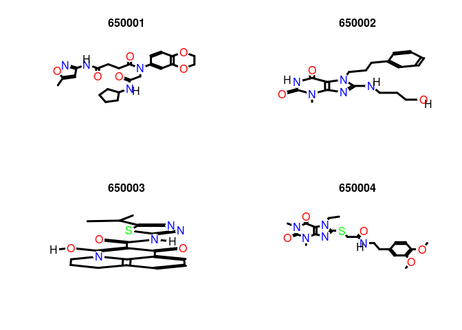
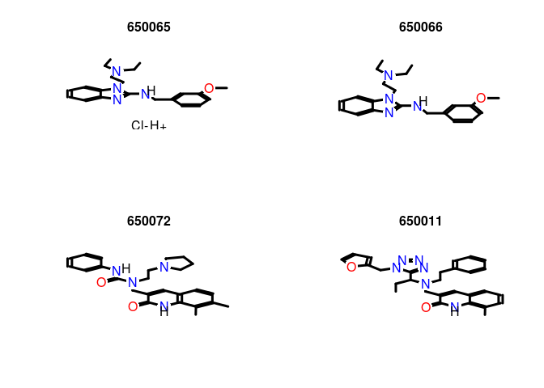
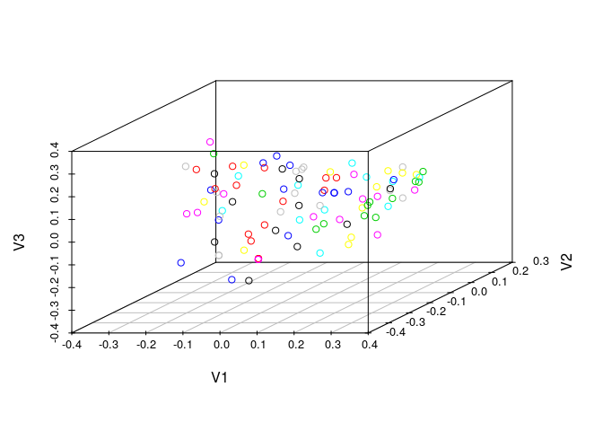
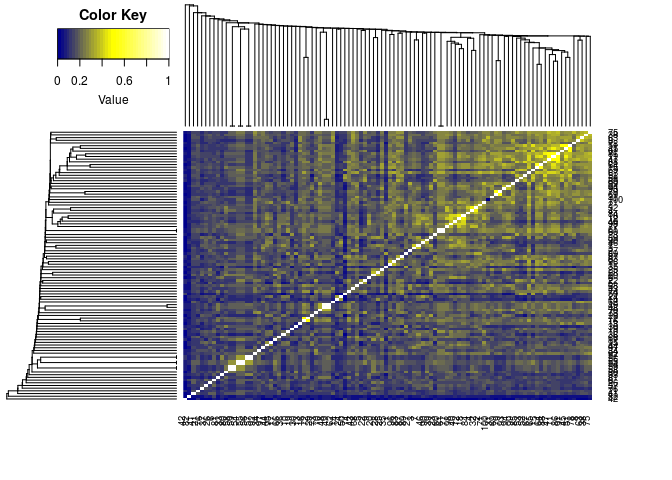

<!--
%% \VignetteEngine{knitr::rmarkdown}
%% \VignetteEncoding{UTF-8}
%\VignetteIndexEntry{ChemmineR}
%% \VignetteDepends{ChemmineOB, fmcsR, ChemmineDrugs}
%% \VignetteKeywords{cheminformatics, structural searching, clustering}
%% \VignettePackage{ChemmineR}
-->

<!---
- Compile from command-line
echo "rmarkdown::render('ChemmineR.Rmd'), clean=F" | R -slave; R CMD Stangle ChemmineR.Rmd; 
Rscript ../md2jekyll.R ChemmineR.knit.md 7

- Commit to github
git commit -am "some edits"; git push -u origin master

- To customize font size and other style features, add this line to output section in preamble:  
    css: style.css
-->

<script type="text/javascript">
document.addEventListener("DOMContentLoaded", function() {
  document.querySelector("h1").className = "title";
});
</script>
<script type="text/javascript">
document.addEventListener("DOMContentLoaded", function() {
  var links = document.links;  
  for (var i = 0, linksLength = links.length; i < linksLength; i++)
    if (links[i].hostname != window.location.hostname)
      links[i].target = '_blank';
});
</script>


Alternative formats of this tutorial:
[`.Rmd HTML`](http://girke.bioinformatics.ucr.edu/manuals/vignettes/ChemmineR/ChemmineR.html), 
[`.Rmd Source`](http://girke.bioinformatics.ucr.edu/manuals/vignettes/ChemmineR/ChemmineR.Rmd), 
[`.R Source`](http://girke.bioinformatics.ucr.edu/manuals/vignettes/ChemmineR/ChemmineR.R), 
[`PDF Slides`](http://faculty.ucr.edu/~tgirke/HTML_Presentations/Manuals/Workshop_Dec_5_8_2014/Rcheminfo/Cheminfo.pdf)

Note: the most recent version of this tutorial can be found <a href="https://htmlpreview.github.io/?https://github.com/girke-lab/ChemmineR/blob/master/vignettes/ChemmineR.html">here</a> and a short overview slide show [here](http://faculty.ucr.edu/~tgirke/HTML_Presentations/Manuals/Workshop_Dec_5_8_2014/Rcheminfo/Cheminfo.pdf).


Introduction
============

`ChemmineR` is a cheminformatics package for analyzing
drug-like small molecule data in R. Its latest version contains
functions for efficient processing of large numbers of small molecules,
physicochemical/structural property predictions, structural similarity
searching, classification and clustering of compound libraries with a
wide spectrum of algorithms.


In addition, `ChemmineR` offers visualization functions
for compound clustering results and chemical structures. The integration
of chemoinformatic tools with the R programming environment has many
advantages, such as easy access to a wide spectrum of statistical
methods, machine learning algorithms and graphic utilities. The first
version of this package was published in Cao et al. [-@Cao_2008]. Since then many additional
utilities and add-on packages have been added to the environment (Figure 2) and
many more are under development for future releases [@Backman_2011; @Wang_2013].

</br>

__Recently Added Features__

-   Improved SMILES support via new `SMIset` object class
    and SMILES import/export functions

-   Integration of a subset of OpenBabel functionalities via new
    `ChemmineOB` add-on package [@Cao_2008]

-   Streaming functionality for processing millions of molecules on a
    laptop

-   Mismatch tolerant maximum common substructure (MCS) search algorithm

-   Fast and memory efficient fingerprint search support using atom pair
    or PubChem fingerprints

<div align="right">[Back to Table of Contents]()</div>

Getting Started
===============

Installation
------------

The R software for running ChemmineR can be downloaded from CRAN
(<http://cran.at.r-project.org/>). The ChemmineR package can be
installed from R using the `bioLite` install command.


```r
 source("http://bioconductor.org/biocLite.R") # Sources the biocLite.R installation script. 
 biocLite("ChemmineR") # Installs the package. 
```

<div align="right">[Back to Table of Contents]()</div>

Loading the Package and Documentation
-------------------------------------


```r
 library("ChemmineR") # Loads the package
```


```r
 library(help="ChemmineR") # Lists all functions and classes 
 vignette("ChemmineR") # Opens this PDF manual from R 
```

<div align="right">[Back to Table of Contents]()</div>

Five Minute Tutorial
--------------------

The following code gives an overview of the most important
functionalities provided by `ChemmineR`. Copy and paste
of the commands into the R console will demonstrate their utilities.  

Create Instances of `SDFset` class: 

```r
 data(sdfsample) 
 sdfset <- sdfsample
 sdfset # Returns summary of SDFset 
```

```
## An instance of "SDFset" with 100 molecules
```

```r
 sdfset[1:4] # Subsetting of object
```

```
## An instance of "SDFset" with 4 molecules
```

```r
 sdfset[[1]] # Returns summarized content of one SDF
```

```
## An instance of "SDF"
## 
## <<header>>
##                             Molecule_Name                                    Source 
##                                  "650001"                  "  -OEChem-07071010512D" 
##                                   Comment                               Counts_Line 
##                                        "" " 61 64  0     0  0  0  0  0  0999 V2000" 
## 
## <<atomblock>>
##           C1      C2  C3  C5  C6  C7  C8  C9 C10 C11 C12 C13 C14 C15 C16
## O_1   7.0468  0.0839   0   0   0   0   0   0   0   0   0   0   0   0   0
## O_2  12.2708  1.0492   0   0   0   0   0   0   0   0   0   0   0   0   0
## ...      ...     ... ... ... ... ... ... ... ... ... ... ... ... ... ...
## H_60  1.8411 -1.5985   0   0   0   0   0   0   0   0   0   0   0   0   0
## H_61  2.6597 -1.2843   0   0   0   0   0   0   0   0   0   0   0   0   0
## 
## <<bondblock>>
##      C1  C2  C3  C4  C5  C6  C7
## 1     1  16   2   0   0   0   0
## 2     2  23   1   0   0   0   0
## ... ... ... ... ... ... ... ...
## 63   33  60   1   0   0   0   0
## 64   33  61   1   0   0   0   0
## 
## <<datablock>> (33 data items)
##           PUBCHEM_COMPOUND_CID PUBCHEM_COMPOUND_CANONICALIZED      PUBCHEM_CACTVS_COMPLEXITY 
##                       "650001"                            "1"                          "700" 
##  PUBCHEM_CACTVS_HBOND_ACCEPTOR                                
##                            "7"                          "..."
```

```r
 view(sdfset[1:4]) # Returns summarized content of many SDFs, not printed here 
 as(sdfset[1:4], "list") # Returns complete content of many SDFs, not printed here 
```


An `SDFset` is created during the import of an SD file:


```r
 sdfset <- read.SDFset("http://faculty.ucr.edu/ tgirke/Documents/R_BioCond/Samples/sdfsample.sdf") 
```


Miscellaneous accessor methods for `SDFset` container:


```r
 header(sdfset[1:4]) # Not printed here
```
 

```r
 header(sdfset[[1]])
```

```
##                             Molecule_Name                                    Source 
##                                  "650001"                  "  -OEChem-07071010512D" 
##                                   Comment                               Counts_Line 
##                                        "" " 61 64  0     0  0  0  0  0  0999 V2000"
```


```r
 atomblock(sdfset[1:4]) # Not printed here 
```
 

```r
atomblock(sdfset[[1]])[1:4,] 
```

```
##          C1     C2 C3 C5 C6 C7 C8 C9 C10 C11 C12 C13 C14 C15 C16
## O_1  7.0468 0.0839  0  0  0  0  0  0   0   0   0   0   0   0   0
## O_2 12.2708 1.0492  0  0  0  0  0  0   0   0   0   0   0   0   0
## O_3 12.2708 3.1186  0  0  0  0  0  0   0   0   0   0   0   0   0
## O_4  7.9128 2.5839  0  0  0  0  0  0   0   0   0   0   0   0   0
```


```r
bondblock(sdfset[1:4]) # Not printed here 
```
 

```r
 bondblock(sdfset[[1]])[1:4,] 
```

```
##   C1 C2 C3 C4 C5 C6 C7
## 1  1 16  2  0  0  0  0
## 2  2 23  1  0  0  0  0
## 3  2 27  1  0  0  0  0
## 4  3 25  1  0  0  0  0
```

```r
 datablock(sdfset[1:4]) # Not printed here 
```


```r
 datablock(sdfset[[1]])[1:4] 
```

```
##           PUBCHEM_COMPOUND_CID PUBCHEM_COMPOUND_CANONICALIZED      PUBCHEM_CACTVS_COMPLEXITY 
##                       "650001"                            "1"                          "700" 
##  PUBCHEM_CACTVS_HBOND_ACCEPTOR 
##                            "7"
```


Assigning compound IDs and keeping them unique: 

```r
 cid(sdfset)[1:4] # Returns IDs from SDFset object
```

```
## [1] "CMP1" "CMP2" "CMP3" "CMP4"
```

```r
 sdfid(sdfset)[1:4] # Returns IDs from SD file header block
```

```
## [1] "650001" "650002" "650003" "650004"
```

```r
 unique_ids <- makeUnique(sdfid(sdfset))
```

```
## [1] "No duplicates detected!"
```

```r
 cid(sdfset) <- unique_ids 
```


Converting the data blocks in an `SDFset` to a matrix:


```r
 blockmatrix <- datablock2ma(datablocklist=datablock(sdfset)) # Converts data block to matrix 
 numchar <- splitNumChar(blockmatrix=blockmatrix) # Splits to numeric and character matrix 
 numchar[[1]][1:2,1:2] # Slice of numeric matrix 
```

```
##        PUBCHEM_COMPOUND_CID PUBCHEM_COMPOUND_CANONICALIZED
## 650001               650001                              1
## 650002               650002                              1
```

```r
 numchar[[2]][1:2,10:11] # Slice of character matrix 
```

```
##        PUBCHEM_MOLECULAR_FORMULA PUBCHEM_OPENEYE_CAN_SMILES                                     
## 650001 "C23H28N4O6"              "CC1=CC(=NO1)NC(=O)CCC(=O)N(CC(=O)NC2CCCC2)C3=CC4=C(C=C3)OCCO4"
## 650002 "C18H23N5O3"              "CN1C2=C(C(=O)NC1=O)N(C(=N2)NCCCO)CCCC3=CC=CC=C3"
```


Compute atom frequency matrix, molecular weight and formula:


```r
 propma <- data.frame(MF=MF(sdfset), MW=MW(sdfset), atomcountMA(sdfset))
 propma[1:4, ] 
```

```
##                 MF       MW  C  H N O S F Cl
## 650001  C23H28N4O6 456.4916 23 28 4 6 0 0  0
## 650002  C18H23N5O3 357.4069 18 23 5 3 0 0  0
## 650003 C18H18N4O3S 370.4255 18 18 4 3 1 0  0
## 650004 C21H27N5O5S 461.5346 21 27 5 5 1 0  0
```


Assign matrix data to data block: 

```r
 datablock(sdfset) <- propma 
 datablock(sdfset[1]) 
```

```
## $`650001`
##           MF           MW            C            H            N            O            S 
## "C23H28N4O6"   "456.4916"         "23"         "28"          "4"          "6"          "0" 
##            F           Cl 
##          "0"          "0"
```


String searching in `SDFset`: 

```r
 grepSDFset("650001", sdfset, field="datablock", mode="subset") # Returns summary view of matches. Not printed here.
```


```r
 grepSDFset("650001", sdfset, field="datablock", mode="index") 
```

```
## 1 1 1 1 1 1 1 1 1 
## 1 2 3 4 5 6 7 8 9
```


Export SDFset to SD file: 

```r
 write.SDF(sdfset[1:4], file="sub.sdf", sig=TRUE) 
```


Plot molecule structure of one or many SDFs: 

```r
 plot(sdfset[1:4], print=FALSE) # Plots structures to R graphics device 
```

\


```r
 sdf.visualize(sdfset[1:4]) # Compound viewing in web browser 
```


Structure similarity searching and clustering: 

```r
 apset <- sdf2ap(sdfset) # Generate atom pair descriptor database for searching 
```


```r
 data(apset) # Load sample apset data provided by library. 
 cmp.search(apset, apset[1], type=3, cutoff = 0.3, quiet=TRUE) # Search apset database with single compound. 
```

```
##   index    cid    scores
## 1     1 650001 1.0000000
## 2    96 650102 0.3516643
## 3    67 650072 0.3117569
## 4    88 650094 0.3094629
## 5    15 650015 0.3010753
```

```r
 cmp.cluster(db=apset, cutoff = c(0.65, 0.5), quiet=TRUE)[1:4,] # Binning clustering using variable similarity cutoffs. 
```

```
## 
## sorting result...
```

```
##       ids CLSZ_0.65 CLID_0.65 CLSZ_0.5 CLID_0.5
## 48 650049         2        48        2       48
## 49 650050         2        48        2       48
## 54 650059         2        54        2       54
## 55 650060         2        54        2       54
```

<div align="right">[Back to Table of Contents]()</div>

OpenBabel Functions
===================

`ChemmineR` integrates now a subset of cheminformatics
functionalities implemented in the OpenBabel C++ library [@greycite13432; @Cao_2008]. These
utilities can be accessed by installing the `ChemmineOB`
package and the OpenBabel software itself. `ChemmineR`
will automatically detect the availability of
`ChemmineOB` and make use of the additional utilities.
The following lists the functions and methods that make use of
OpenBabel. References are included to locate the sections in the manual
where the utility and usage of these functions is described.  

*Structure format interconversions* (see Section [Format Inter-Conversions](#format-interconversions))

-   `smiles2sdf`: converts from SMILES to SDF object

-   `sdf2smiles`: converts from SDF to SMILES object

-   `convertFormat`: converts strings between two formats

-   `convertFormatFile`: converts files between two formats. This function can be used to enable ChemmineR to read in any
format supported by Open Babel. For example, if you had an SML file you could do:

```r
convertFormatFile("SML","SDF","mycompound.sml","mycompound.sdf")
sdfset=read.SDFset("mycompound.sdf")
```


`propOB`: generates several compound properties. See the man page for a current list of properties computed.

```r
propOB(sdfset[1])
```

```
##                                                          cansmi
## 650001 O=C(Nc1noc(c1)C)CCC(=O)N(c1ccc2c(c1)OCCO2)CC(=O)NC1CCCC1
##                                                        cansmiNS    formula  title
## 650001 O=C(Nc1noc(c1)C)CCC(=O)N(c1ccc2c(c1)OCCO2)CC(=O)NC1CCCC1 C23H28N4O6 650001
##                                                                                                                                                                                    InChI
## 650001 InChI=1S/C23H28N4O6/c1-15-12-20(26-33-15)25-21(28)8-9-23(30)27(14-22(29)24-16-4-2-3-5-16)17-6-7-18-19(13-17)32-11-10-31-18/h6-7,12-13,16H,2-5,8-11,14H2,1H3,(H,24,29)(H,25,26,28)
##        HBA1 HBA2 HBD   logP       MR       MW nF TPSA
## 650001   37   10   2 3.0288 119.9234 456.4916  0  123
```

`fingerprintOB`: generates fingerprints for compounds. The fingerprint name can be anything supported by OpenBabel. See the man page
for a current list.

```r
fingerprintOB(sdfset,"FP2")
```

```
## An instance of a 1024 bit "FPset" of type "FP2" with 100 molecules
```

`smartsSearchOB`: find matches of SMARTS patterns in compounds

```r
#count rotable bonds
smartsSearchOB(sdfset[1:5],"[!$(*#*)&!D1]-!@[!$(*#*)&!D1]",uniqueMatches=FALSE)
```

```
## 650001 650002 650003 650004 650005 
##     24     20     14     30     10
```

`exactMassOB`: Compute the monoisotopic (exact) mass of a set of compounds

```r
exactMassOB(sdfset[1:5])
```

```
##   650001   650002   650003   650004   650005 
## 456.2009 357.1801 370.1100 461.1733 318.1943
```

`regenerateCoords`: Re-compute the 2D coordinates of a compound using Open Babel. This can sometimes
improve the quality of the compounds plot. See also the `regenCoords` option of the plot function.

```r
sdfset2 = regenerateCoords(sdfset[1:5])

plot(sdfset[1], regenCoords=TRUE,print=FALSE)
```

\

`generate3DCoords`: Generate 3D coordinates for compounds with only 2D coordinates.

```r
sdf3D = generate3DCoords(sdfset[1])
```

`canonicalize`: Compute a canonicalized atom numbering. This allows compounds with the same molecular
structure but different atom numberings to be compared properly.

```r
canonicalSdf= canonicalize(sdfset[1])
```

`canonicalNumbering`: Return a mapping from the original atom numbering to the 
canonical atom number.

```r
mapping = canonicalNumbering(sdfset[1])
```

<div align="right">[Back to Table of Contents]()</div>


Overview of Classes and Functions
=================================

The following list gives an overview of the most important S4 classes,
methods and functions available in the ChemmineR package. The help
documents of the package provide much more detailed information on each
utility. The standard R help documents for these utilities can be
accessed with this syntax: `?function\_name` (*e.g.*
`?cid`) and `?class\_name-class` (*e.g*.
`?"SDFset-class"`).

<div align="right">[Back to Table of Contents]()</div>

Molecular Structure Data
------------------------

Classes

-   `SDFstr`: intermediate string class to facilitate SD
    file import; not important for end user

-   `SDF`: container for single molecule imported from an
    SD file

-   `SDFset`: container for many SDF objects; most
    important structure container for end user

-   `SMI`: container for a single SMILES string

-   `SMIset`: container for many SMILES strings

Functions/Methods (mainly for `SDFset` container,
`SMIset` should be coerced with
`smiles2sd` to `SDFset`)

-   Accessor methods for `SDF/SDFset`

    -   Object slots: `cid`, `header`, `atomblock`, `bondblock`,
        `datablock` (`sdfid`, `datablocktag`)

    -   Summary of `SDFset`: `view`

    -   Matrix conversion of data block: `datablock2ma`,
        `splitNumChar`

    -   String search in SDFset: `grepSDFset`

-   Coerce one class to another

    -   Standard syntax `as(..., "...")` works in most
        cases. For details see R help with
       `?"SDFset-class"`.

-   Utilities

    -   Atom frequencies: `atomcountMA`, `atomcount`

    -   Molecular weight: `MW`

    -   Molecular formula: `MF`

    -   ...

-   Compound structure depictions

    -   R graphics device: `plot`, `plotStruc`

    -   Online: `cmp.visualize`

<div align="right">[Back to Table of Contents]()</div>

Structure Descriptor Data
-------------------------

Classes

-   `AP`: container for atom pair descriptors of a single
    molecule

-   `APset`: container for many AP objects; most
    important structure descriptor container for end user

-   `FP`: container for fingerprint of a single molecule

-   `FPset`: container for fingerprints of many
    molecules, most important structure descriptor container for end
    user

Functions/Methods

-   Create `AP/APset` instances

    -   From `SDFset`: `sdf2ap`

    -   From SD file: `cmp.parse`

    -   Summary of `AP/APset`: `view`,
        `db.explain`

-   Accessor methods for AP/APset

    -   Object slots: `ap`, `cid`

-   Coerce one class to another

    -   Standard syntax `as(..., "...")` works in most
        cases. For details see R help with
        `?"APset-class"`.

-   Structure Similarity comparisons and Searching

    -   Compute pairwise similarities : `cmp.similarity`,
        `fpSim`

    -   Search APset database: `cmp.search`, `fpSim`

-   AP-based Structure Similarity Clustering

    -   Single-linkage binning clustering: `cmp.cluster`

    -   Visualize clustering result with MDS:
        `cluster.visualize`

    -   Size distribution of clusters: `cluster.sizestat`
-   Folding
    - Fold a descriptor with `fold`
	 - Query the number of times a descriptor has been folded:
		`foldCount`
	 - Query the number of bits in a descriptor: `numBits`
	 
<div align="right">[Back to Table of Contents]()</div>

Import of Compounds
===================

SDF Import
----------

The following gives an overview of the most important import/export
functionalities for small molecules provided by
`ChemmineR`. The given example creates an instance of the
`SDFset` class using as sample data set the first 100
compounds from this PubChem SD file (SDF):
Compound\_00650001\_00675000.sdf.gz
(<ftp://ftp.ncbi.nih.gov/pubchem/Compound/CURRENT-Full/SDF/>).  

SDFs can be imported with the `read.SDFset` function:


```r
 sdfset <- read.SDFset("http://faculty.ucr.edu/ tgirke/Documents/R_BioCond/Samples/sdfsample.sdf") 
```


```r
 data(sdfsample) # Loads the same SDFset provided by the library 
 sdfset <- sdfsample
 valid <- validSDF(sdfset) # Identifies invalid SDFs in SDFset objects 
 sdfset <- sdfset[valid] # Removes invalid SDFs, if there are any 
```


Import SD file into `SDFstr` container: 

```r
 sdfstr <- read.SDFstr("http://faculty.ucr.edu/ tgirke/Documents/R_BioCond/Samples/sdfsample.sdf") 
```
Create
`SDFset` from `SDFstr` class:


```r
 sdfstr <- as(sdfset, "SDFstr") 
 sdfstr
```

```
## An instance of "SDFstr" with 100 molecules
```

```r
 as(sdfstr, "SDFset") 
```

```
## An instance of "SDFset" with 100 molecules
```

<div align="right">[Back to Table of Contents]()</div>

SMILES Import
-------------

The `read.SMIset` function imports one or many molecules
from a SMILES file and stores them in a `SMIset`
container. The input file is expected to contain one SMILES string per
row with tab-separated compound identifiers at the end of each line. The
compound identifiers are optional.  

Create sample SMILES file and then import it: 

```r
 data(smisample); smiset <- smisample
 write.SMI(smiset[1:4], file="sub.smi") 
 smiset <- read.SMIset("sub.smi")
```


Inspect content of `SMIset`: 

```r
 data(smisample) # Loads the same SMIset provided by the library 
 smiset <- smisample
 smiset 
```

```
## An instance of "SMIset" with 100 molecules
```

```r
 view(smiset[1:2]) 
```

```
## $`650001`
## An instance of "SMI"
## [1] "O=C(NC1CCCC1)CN(c1cc2OCCOc2cc1)C(=O)CCC(=O)Nc1noc(c1)C"
## 
## $`650002`
## An instance of "SMI"
## [1] "O=c1[nH]c(=O)n(c2nc(n(CCCc3ccccc3)c12)NCCCO)C"
```


Accessor functions: 

```r
 cid(smiset[1:4]) 
```

```
## [1] "650001" "650002" "650003" "650004"
```

```r
 smi <- as.character(smiset[1:2])
```


Create `SMIset` from named character vector:


```r
 as(smi, "SMIset") 
```

```
## An instance of "SMIset" with 2 molecules
```

<div align="right">[Back to Table of Contents]()</div>

Export of Compounds
===================

SDF Export
----------

Write objects of classes `SDFset/SDFstr/SDF` to SD file:


```r
 write.SDF(sdfset[1:4], file="sub.sdf") 
```


Writing customized `SDFset` to file containing
`ChemmineR` signature, IDs from `SDFset`
and no data block: 

```r
 write.SDF(sdfset[1:4], file="sub.sdf", sig=TRUE, cid=TRUE, db=NULL) 
```


Example for injecting a custom matrix/data frame into the data block of
an `SDFset` and then writing it to an SD file:


```r
 props <- data.frame(MF=MF(sdfset), MW=MW(sdfset), atomcountMA(sdfset)) 
 datablock(sdfset) <- props
 write.SDF(sdfset[1:4], file="sub.sdf", sig=TRUE, cid=TRUE) 
```


Indirect export via `SDFstr` object: 

```r
 sdf2str(sdf=sdfset[[1]], sig=TRUE, cid=TRUE) # Uses default components 
 sdf2str(sdf=sdfset[[1]], head=letters[1:4], db=NULL) # Uses custom components for header and data block 
```


Write `SDF`, `SDFset` or
`SDFstr` classes to file: 

```r
 write.SDF(sdfset[1:4], file="sub.sdf", sig=TRUE, cid=TRUE, db=NULL)
 write.SDF(sdfstr[1:4], file="sub.sdf") 
 cat(unlist(as(sdfstr[1:4], "list")), file="sub.sdf", sep="") 
```

<div align="right">[Back to Table of Contents]()</div>

SMILES Export
-------------

Write objects of class `SMIset` to SMILES file with and
without compound identifiers: 

```r
 data(smisample); smiset <- smisample # Sample data set 

 write.SMI(smiset[1:4], file="sub.smi", cid=TRUE) write.SMI(smiset[1:4], file="sub.smi", cid=FALSE) 
```

<div align="right">[Back to Table of Contents]()</div>

Format Interconversions
=======================

The `sdf2smiles` and `smiles2sdf`
functions provide format interconversion between SMILES strings
(Simplified Molecular Input Line Entry Specification) and
`SDFset` containers.  

Convert an `SDFset` container to a SMILES
`character` string:


```r
 data(sdfsample);
 sdfset <- sdfsample[1] 
 smiles <- sdf2smiles(sdfset) 
 smiles 
```


Convert a SMILES `character` string to an
`SDFset` container:


```r
 sdf <- smiles2sdf("CC(=O)OC1=CC=CC=C1C(=O)O")
 view(sdf) 
```


When the `ChemineOB` package is installed these
conversions are performed with the OpenBabel Open Source Chemistry
Toolbox. Otherwise the functions will fall back to using the ChemMine
Tools web service for this operation. The latter will require internet
connectivity and is limited to only the first compound given.
`ChemmineOB` provides access to the compound format
conversion functions of OpenBabel. Currently, over 160 formats are
supported by OpenBabel. The functions `convertFormat` and
`convertFormatFile` can be used to convert files or
strings between any two formats supported by OpenBabel. For example, to
convert a SMILES string to an SDF string, one can use the
`convertFormat` function.


```r
 sdfStr <- convertFormat("SMI","SDF","CC(=O)OC1=CC=CC=C1C(=O)O_name") 
```


This will return the given compound as an SDF formatted string. 2D
coordinates are also computed and included in the resulting SDF string.

To convert a file with compounds encoded in one format to another
format, the `convertFormatFile` function can be used
instead. 

```r
 convertFormatFile("SMI","SDF","test.smiles","test.sdf") 
```


To see the whole list of file formats supported by OpenBabel, one can
run from the command-line "obabel -L formats".

<div align="right">[Back to Table of Contents]()</div>

Splitting SD Files
==================

The following `write.SDFsplit` function allows to split
SD Files into any number of smaller SD Files. This can become important
when working with very big SD Files. Users should note that this
function can output many files, thus one should run it in a dedicated
directory!  

Create sample SD File with 100 molecules: 

```r
 write.SDF(sdfset, "test.sdf") 
```


Read in sample SD File. Note: reading file into SDFstr is much faster
than into SDFset: 

```r
 sdfstr <- read.SDFstr("test.sdf") 
```


Run export on `SDFstr` object: 

```r
 write.SDFsplit(x=sdfstr, filetag="myfile", nmol=10) # 'nmol' defines the number of molecules to write to each file 
```


Run export on `SDFset` object: 

```r
 write.SDFsplit(x=sdfset, filetag="myfile", nmol=10) 
```

<div align="right">[Back to Table of Contents]()</div>

Streaming Through Large SD Files
================================

The `sdfStream` function allows to stream through SD
Files with millions of molecules without consuming much memory. During
this process any set of descriptors, supported by
`ChemmineR`, can be computed (*e.g.* atom pairs,
molecular properties, etc.), as long as they can be returned in tabular
format. In addition to descriptor values, the function returns a line
index that gives the start and end positions of each molecule in the
source SD File. This line index can be used by the downstream
`read.SDFindex` function to retrieve specific molecules
of interest from the source SD File without reading the entire file into
R. The following outlines the typical workflow of this streaming
functionality in `ChemmineR`.  

Create sample SD File with 100 molecules: 

```r
 write.SDF(sdfset, "test.sdf") 
```


Define descriptor set in a simple function: 

```r
 desc <- function(sdfset) 
 cbind(SDFID=sdfid(sdfset), 
	# datablock2ma(datablocklist=datablock(sdfset)), 
	 MW=MW(sdfset),
	groups(sdfset), APFP=desc2fp(x=sdf2ap(sdfset), descnames=1024,
	type="character"), AP=sdf2ap(sdfset, type="character"), rings(sdfset,
	type="count", upper=6, arom=TRUE) )  
```


Run `sdfStream` with `desc` function and
write results to a file called `matrix.xls`:


```r
 sdfStream(input="test.sdf", output="matrix.xls", fct=desc, Nlines=1000) # 'Nlines': number of lines to read from input SD File at a time 
```


One can also start reading from a specific line number in the SD file.
The following example starts at line number 950. This is useful for
restarting and debugging the process. With `append=TRUE`
the result can be appended to an existing file. 

```r
 sdfStream(input="test.sdf", output="matrix2.xls", append=FALSE, fct=desc, Nlines=1000, startline=950) 
```


Select molecules meeting certain property criteria from SD File using
line index generated by previous `sdfStream` step:


```r
 indexDF <- read.delim("matrix.xls", row.names=1)[,1:4] 
 indexDFsub <- indexDF[indexDF$MW < 400, ] # Selects molecules with MW < 400 
 sdfset <- read.SDFindex(file="test.sdf", index=indexDFsub, type="SDFset") # Collects results in 'SDFset' container 
```


Write results directly to SD file without storing larger numbers of
molecules in memory: 

```r
 read.SDFindex(file="test.sdf", index=indexDFsub, type="file",
 outfile="sub.sdf") 
```


Read AP/APFP strings from file into `APset` or
`FP` object: 

```r
 apset <- read.AP(x="matrix.xls", type="ap", colid="AP") 
 apfp <- read.AP(x="matrix.xls", type="fp", colid="APFP") 
```


Alternatively, one can provide the AP/APFP strings in a named character
vector: 

```r
 apset <- read.AP(x=sdf2ap(sdfset[1:20], type="character"), type="ap") 
 fpchar <- desc2fp(sdf2ap(sdfset[1:20]), descnames=1024, type="character")
 fpset <- as(fpchar, "FPset") 
```

<div align="right">[Back to Table of Contents]()</div>

Storing Compounds in an SQL Database
====================================

As an alternative to sdfStream, there is now also an option to store
data in an SQL database, which then allows for fast queries and compound
retrieval. The default database
is SQLite, but any other SQL database should work with some minor
modifications to the table definitions, which are stored in
schema/compounds.SQLite under the ChemmineR package directory. Compounds
are stored in their entirety in the databases so there is no need to
keep any original data files.

Users can define their own set of compound features to compute and store
when loading new compounds. Each of these features will be stored in its
own, indexed table. Searches can then be performed using these features
to quickly find specific compounds. Compounds can always be retrieved
quickly because of the database index, no need to scan a large compound
file. In addition to user defined features, descriptors can also be
computed and stored for each compound.

A new database can be created with the `initDb` function.
This takes either an existing database connection, or a filename. If a
filename is given then an SQLite database connection is created. It then
ensures that the required tables exist and creates them if not. The
connection object is then returned. This function can be called safely
on the same connection or database many times and will not delete any
data.

<div align="right">[Back to Table of Contents]()</div>

Loading Data
------------

The functions `loadSdf` and `loadSmiles` can be used to load
compound data from either a file (both) or an `SDFset` (`loadSdf`
only).  The `fct` parameter should be a function to
extract features from the data. It will be handed an
`SDFset` generated from the data being loaded. This may
be done in batches, so there is no guarantee that the given SDFSset will
contain the whole dataset. This function should return a data frame with
a column for each feature and a row for each compound given. The order
of the final data frame should be the same as that of the
`SDFset`. The column names will become the feature names.
Each of these features will become a new, indexed, table in the database
which can be used later to search for compounds.

The `descriptors` parameter can be a function which
computes descriptors. This function will also be given an
`SDFset` object, which may be done in batches. It should
return a data frame with the following two columns: "descriptor" and
"descriptor\_type". The "descriptor" column should contain a string
representation of the descriptor, and "descriptor\_type" is the type of
the descriptor. Our convention for atom pair is "ap" and "fp" for finger
print. The order should also be maintained.

When the data has been loaded, `loadSdf` will return the
compound id numbers of each compound loaded. These compound id numbers
are computed by the database and are not extracted from the compound
data itself. They can be used to quickly retrieve compounds later.

New features can also be added using this function. However, all
compounds must have all features so if new features are added to a new
set of compounds, all existing features must be computable by the
`fct` function given. If new features are detected, all
existing compounds will be run through `fct` in order to
compute the new features for them as well.

For example, if dataset X is loaded with features F1 and F2, and then at
a later time we load dataset Y with new feature F3, the
`fct` function used to load dataset Y must compute and
return features F1, F2, and F3. `loadSdf` will call
`fct` with both datasets X and Y so that all features are
available for all compounds. If any features are missing an error will
be raised. If just new features are being added, but no new compounds,
use the `addNewFeatures` function.

In this example, we create a new database called "test.db" and load it
with data from an `SDFset`. We also define
`fct` to compute the molecular weight, "MW", and the
number of rings and aromatic rings. The rings function actually returns
a data frame with columns "RINGS" and "AROMATIC", which will be merged
into the data frame being created which will also contain the "MW"
column. These will be the names used for these features and must be used
when searching with them. Finally, the new compound ids are returned and
stored in the "ids" variable.


```r
 data(sdfsample)

 #create and initialize a new SQLite database 
 conn <- initDb("test.db")
```

```
## Loading required package: RSQLite
```

```
## Loading required package: DBI
```

```r
 # load data and compute 3 features: molecular weight, with the MW function, 
 # and counts for RINGS and AROMATIC, as computed by rings, which 
 # returns a data frame itself. 
 ids<-loadSdf(conn,sdfsample, function(sdfset) 
					 data.frame(rings(sdfset,type="count",upper=6, arom=TRUE),propOB(sdfset)) ) 

 #list features in the database:
 print(listFeatures(conn))
```

```
##  [1] "aromatic" "cansmi"   "cansmins" "formula"  "hba1"     "hba2"     "hbd"      "inchi"   
##  [9] "logp"     "mr"       "mw"       "nf"       "rings"    "title"    "tpsa"
```

<div align="right">[Back to Table of Contents]()</div>

Updates
-------
By default the `loadSdf` / `loadSmiles` functions will detect duplicate
compound entries and only insert one of them. This means it is safe
to run these functions on the same data set several times and you
won't end up with duplicates. This allows the functions to be re-run
in the event that a previous run on a dataset does not complete.
Duplicate compounds are detected by compouting the MD5 checksum on
the textual representation of it. 

It can also update existing compounds with new versions of the same
compound. To enable this, set `updateByName` to true. It will then
consider two compounds with the same name to be the same, even if the
definition is different. Then, if the name of a compound exists in
the database and it is trying to insert another compound with the
same name, it will overwrite the existing compound. It will also drop
and re-compute all associated descriptors and features for the new
compound (assuming the required functions for descriptor and feature
computation are available at the time the update is performed).

<div align="right">[Back to Table of Contents]()</div>

Duplicate Descriptors
---------------------
It is often the case when loading a large set of compounds that
several compounds will produce the same descriptor. `ChemmineR` 
detects this case and only stores one copy of the descriptor for
every compound it is for. This feature saves some space and some
time for processes that need to be applied to every descriptor.
It also highlights a new problem. If you have a descriptor in hand
and you want to find a single compound to represent it, which
compound should be used if the descriptor was produced from multiple
compounds? To address this problem, `ChemmineR` allows you to set
priority values for each compound-descriptor mapping. Then, in
contexts where a single compound is required, the highest priority
compound will be chosen. Highest priority corresponds to the lowest
numerical value. So mapping with priority 0 would be used first.

To set these priorities there is the function `setPriorities`.
It takes a function, `priorityFn`, for computing these priority values.
The `setPriorities` function should be run after loading a complete set of data.
It will find each group of compounds which share the same
descriptor and call the given function, `priorityFn`, 
with the compound_id numbers of the group. This function should
then assign priorities to each compound-descriptor pair, however
it wishes. 

One built in priority function is `forestSizePriorities`. This simply
prefers compounds with fewer disconnected components over compounds with
more dissconnected components.


```r
setPriorities(conn,forestSizePriorities)
```

<div align="right">[Back to Table of Contents]()</div>


Searching
---------

Compounds can be searched for using the `findCompounds`
function. This function takes a connection object, a vector of feature
names used in the tests, and finally, a vector of tests that must all
pass for a compound to be included in the result set. Each test should
be a boolean expression. For example: `c("MW <= 400","RINGS \> 3")`
would return all compounds with a molecular weight of 400 or less and
more than 3 rings, assuming these features exist in the database. The
syntax for each test is `'\<feature name\> \<SQL operator\> \<value\>'`.
If you know SQL you can go beyond this basic syntax. These tests will
simply be concatenated together with "AND" in-between them and tacked on
the end of a WHERE clause of an SQL statement. So any SQL that will work
in that context is fine. The function will return a list of compound
ids, the actual compounds can be fetched with
`getCompounds`. If just the names are needed, the
`getCompoundNames` function can be used. Compounds can
also be fetched by name using the `findCompoundsByName`
function.

In this example we search for compounds with molecular weight less than
300.


```r
results = findCompounds(conn,"mw",c("mw < 300"))
message("found ",length(results))
```

```
## found 23
```

If more than one test is given, only compounds which satisfy all tests are found. So if we wanted
to further restrict our search to compounds with 2 or more aromatic rings we could do:

```r
results = findCompounds(conn,c("mw","aromatic"),c("mw < 300","aromatic >= 2"))
message("found ",length(results))
```

```
## found 9
```

Remember that any feature used in some test must be listed in the second argument.

String patterns can also be used. So if we wanted to match a substring of the molecular formula, say
to find compounds with 21 carbon atoms, we could do:

```r
results = findCompounds(conn,"formula",c("formula like '%C21%'"))
message("found ",length(results))
```

```
## found 12
```

The "like" operator does a pattern match. There are two wildcard 
operators that can be used with this operator. The "%" will match any stretch of characters while the "?"
will match any single character. So the above expression would match a formula like "C21H28N4O6".

Valid comparison operators are: 

 - <,    <=,   > ,   >=
 - =,    ==,   !=,   <>,   IS,   IS NOT,   IN,   LIKE 

The boolean operators "AND" and "OR" can also be used to create more complex expressions within a single test.

If you just want to fetch every compound in the database you can use the `getAllCompoundIds` function:

```r
allIds = getAllCompoundIds(conn)
message("found ",length(allIds))
```

```
## found 100
```

<div align="right">[Back to Table of Contents]()</div>

Using Search Results
-----------------------
Once you have a list of compound ids from the `findCompounds` function, you can either
fetch the compound names, or the whole set of compounds as an SDFset. 


```r
#get the names of the compounds:
names = getCompoundNames(conn,results)

#if the name order is important set keepOrder=TRUE 
#It will take a little longer though
names = getCompoundNames(conn,results,keepOrder=TRUE) 


# get the whole set of compounds
compounds = getCompounds(conn,results)
#in order:
compounds = getCompounds(conn,results,keepOrder=TRUE)
#write results directly to a file:
compounds = getCompounds(conn,results,filename=file.path(tempdir(),"results.sdf"))
```

Using the `getCompoundFeatures` function, you can get a set of feature values 
as a data frame:

```r
getCompoundFeatures(conn,results[1:5],c("mw","logp","formula"))
```

```
##   compound_id       mw   logp       formula
## 1         204 461.5346 1.3127   C21H27N5O5S
## 2         208 438.4780 3.5492  C21H19FN6O2S
## 3         221 340.4592 3.1325    C21H28N2O2
## 4         238 447.9351 5.2940 C21H22ClN3O4S
## 5         243 456.5181 3.0020   C21H24N6O4S
```

```r
#write results directly to a CSV file (reduces memory usage):
getCompoundFeatures(conn,results[1:5],c("mw","logp","formula"),filename="features.csv")

#maintain input order in output:
print(results[1:5])
```

```
## [1] 204 208 221 238 243
```

```r
getCompoundFeatures(conn,results[1:5],c("mw","logp","formula"),keepOrder=TRUE)
```

```
##     compound_id       mw   logp       formula
## 204         204 461.5346 1.3127   C21H27N5O5S
## 208         208 438.4780 3.5492  C21H19FN6O2S
## 221         221 340.4592 3.1325    C21H28N2O2
## 238         238 447.9351 5.2940 C21H22ClN3O4S
## 243         243 456.5181 3.0020   C21H24N6O4S
```

<div align="right">[Back to Table of Contents]()</div>

Pre-Built Databases
--------------------
We have pre-built SQLite databases for the Drug Bank and DUD datasets. They can be found in 
the ChemmineDrugs annotation package. Connections to these databases can be fetched from the
functions `DrugBank` and `DUD` to get the corresponding database. Any of the above functions can
then be used to query the database.

The DUD dataset was downloaded from [here](http://dude.docking.org/db/subsets/all/all.tar.gz). A description
can be found [here](http://dude.docking.org/). 

The Drug Bank data set is version 4.1. It can be downloaded [here](http://www.drugbank.ca/system/downloads/current/structures/all.sdf.zip)

The following features are included:

 - **aromatic**: Number of aromatic rings
 - **cansmi**: Canonical SMILES sting
 - **cansmins**:
 - **formula**: Molecular formula
 - **hba1**:
 - **hba2**:
 - **hbd**:
 - **inchi**: INCHI string
 - **logp**:
 - **mr**:
 - **mw**: Molecular weight
 - **ncharges**:
 - **nf**:
 - **r2nh**:
 - **r3n**:
 - **rcch**:
 - **rcho**:
 - **rcn**:
 - **rcooh**:
 - **rcoor**:
 - **rcor**:
 - **rings**:
 - **rnh2**:
 - **roh**:
 - **ropo3**:
 - **ror**:
 - **title**:
 - **tpsa**:

The DUD database additionally includes:

 - **target_name**: Name of the target
 - **type**: either "active" or "decoy"

<div align="right">[Back to Table of Contents]()</div>

Working with SDF/SDFset Classes
===============================

Several methods are available to return the different data components of
`SDF/SDFset` containers in batches. The following
examples list the most important ones. To save space their content is
not printed in the manual. 

```r
 view(sdfset[1:4]) # Summary view of several molecules 

 length(sdfset) # Returns number of molecules 
 sdfset[[1]] # Returns single molecule from SDFset as SDF object 

 sdfset[[1]][[2]] # Returns atom block from first compound as matrix

 sdfset[[1]][[2]][1:4,] 
 c(sdfset[1:4], sdfset[5:8]) # Concatenation of several SDFsets 
```


The `grepSDFset` function allows string
matching/searching on the different data components in
`SDFset`. By default the function returns a SDF summary
of the matching entries. Alternatively, an index of the matches can be
returned with the setting `mode="index"`. 

```r
 grepSDFset("650001", sdfset, field="datablock", mode="subset") # To return index, set mode="index") 
```


Utilities to maintain unique compound IDs: 

```r
 sdfid(sdfset[1:4]) # Retrieves CMP IDs from Molecule Name field in header block. 
 cid(sdfset[1:4]) # Retrieves CMP IDs from ID slot in SDFset. 
 unique_ids <- makeUnique(sdfid(sdfset)) # Creates unique IDs by appending a counter to duplicates. 
 cid(sdfset) <- unique_ids # Assigns uniquified IDs to ID slot 
```


Subsetting by character, index and logical vectors: 

```r
 view(sdfset[c("650001", "650012")])
 view(sdfset[4:1])
 mylog <- cid(sdfset)
 view(sdfset[mylog]) 
```


Accessing `SDF/SDFset` components: header, atom, bond and
data blocks: 

```r
 atomblock(sdf); sdf[[2]];
 sdf[["atomblock"]] # All three methods return the same component

 header(sdfset[1:4]) 
 atomblock(sdfset[1:4])
 bondblock(sdfset[1:4]) 
 datablock(sdfset[1:4])  
 header(sdfset[[1]])
 atomblock(sdfset[[1]]) 
 bondblock(sdfset[[1]]) 
 datablock(sdfset[[1]]) 
```


Replacement Methods: 

```r
 sdfset[[1]][[2]][1,1] <- 999 
 atomblock(sdfset)[1] <- atomblock(sdfset)[2] 
 datablock(sdfset)[1] <- datablock(sdfset)[2] 
```


Assign matrix data to data block: 

```r
 datablock(sdfset) <- as.matrix(iris[1:100,])
 view(sdfset[1:4]) 
```


Class coercions from `SDFstr` to `list`,
`SDF` and `SDFset`: 

```r
 as(sdfstr[1:2], "list") as(sdfstr[[1]], "SDF")
 as(sdfstr[1:2], "SDFset") 
```


Class coercions from `SDF` to `SDFstr`,
`SDFset`, list with SDF sub-components: 

```r
 sdfcomplist <- as(sdf, "list") sdfcomplist <-
 as(sdfset[1:4], "list"); as(sdfcomplist[[1]], "SDF") sdflist <-
 as(sdfset[1:4], "SDF"); as(sdflist, "SDFset") as(sdfset[[1]], "SDFstr")
 as(sdfset[[1]], "SDFset") 
```


Class coercions from `SDFset` to lists with components
consisting of SDF or sub-components: 

```r
 as(sdfset[1:4], "SDF") as(sdfset[1:4], "list") as(sdfset[1:4], "SDFstr")
```

<div align="right">[Back to Table of Contents]()</div>

Molecular Property Functions (Physicochemical Descriptors)
==========================================================

Several methods and functions are available to compute basic compound
descriptors, such as molecular formula (MF), molecular weight (MW), and
frequencies of atoms and functional groups. In many of these functions,
it is important to set `addH=TRUE` in order to
include/add hydrogens that are often not specified in an SD file.


```r
 propma <- atomcountMA(sdfset, addH=FALSE) 
 boxplot(propma, col="blue", main="Atom Frequency") 
```

\


```r
 boxplot(rowSums(propma), main="All Atom Frequency") 
```


Data frame provided by library containing atom names, atom symbols,
standard atomic weights, group and period numbers: 

```r
 data(atomprop)
 atomprop[1:4,] 
```

```
##   Number      Name Symbol Atomic_weight Group Period
## 1      1  hydrogen      H      1.007940     1      1
## 2      2    helium     He      4.002602    18      1
## 3      3   lithium     Li      6.941000     1      2
## 4      4 beryllium     Be      9.012182     2      2
```


Compute MW and formula: 

```r
 MW(sdfset[1:4], addH=FALSE)
```

```
##     CMP1     CMP2     CMP3     CMP4 
## 456.4916 357.4069 370.4255 461.5346
```

```r
 MF(sdfset[1:4], addH=FALSE) 
```

```
##          CMP1          CMP2          CMP3          CMP4 
##  "C23H28N4O6"  "C18H23N5O3" "C18H18N4O3S" "C21H27N5O5S"
```


Enumerate functional groups: 

```r
 groups(sdfset[1:4], groups="fctgroup", type="countMA") 
```

```
##      RNH2 R2NH R3N ROPO3 ROH RCHO RCOR RCOOH RCOOR ROR RCCH RCN
## CMP1    0    2   1     0   0    0    0     0     0   2    0   0
## CMP2    0    2   2     0   1    0    0     0     0   0    0   0
## CMP3    0    1   1     0   1    0    1     0     0   0    0   0
## CMP4    0    1   3     0   0    0    0     0     0   2    0   0
```


Combine MW, MF, charges, atom counts, functional group counts and ring
counts in one data frame: 

```r
 propma <- data.frame(MF=MF(sdfset, addH=FALSE), MW=MW(sdfset, addH=FALSE),
							 Ncharges=sapply(bonds(sdfset, type="charge"), length),
							 atomcountMA(sdfset, addH=FALSE), 
							 groups(sdfset, type="countMA"), 
							 rings(sdfset, upper=6, type="count", arom=TRUE))
 propma[1:4,] 
```

```
##               MF       MW Ncharges  C  H N O S F Cl RNH2 R2NH R3N ROPO3 ROH RCHO RCOR RCOOH RCOOR
## CMP1  C23H28N4O6 456.4916        0 23 28 4 6 0 0  0    0    2   1     0   0    0    0     0     0
## CMP2  C18H23N5O3 357.4069        0 18 23 5 3 0 0  0    0    2   2     0   1    0    0     0     0
## CMP3 C18H18N4O3S 370.4255        0 18 18 4 3 1 0  0    0    1   1     0   1    0    1     0     0
## CMP4 C21H27N5O5S 461.5346        0 21 27 5 5 1 0  0    0    1   3     0   0    0    0     0     0
##      ROR RCCH RCN RINGS AROMATIC
## CMP1   2    0   0     4        2
## CMP2   0    0   0     3        3
## CMP3   0    0   0     4        2
## CMP4   2    0   0     3        3
```


The following shows an example for assigning the values stored in a
matrix (*e.g.* property descriptors) to the data block components in an
`SDFset`. Each matrix row will be assigned to the
corresponding slot position in the `SDFset`.


```r
 datablock(sdfset) <- propma # Works with all SDF components 
 datablock(sdfset)[1:4] 
 test <- apply(propma[1:4,], 1, function(x) 
 data.frame(col=colnames(propma), value=x)) 
```


The data blocks in SDFs contain often important annotation information
about compounds. The `datablock2ma` function returns this
information as matrix for all compounds stored in an
`SDFset` container. The `splitNumChar`
function can then be used to organize all numeric columns in a
`numeric matrix` and the character columns in a
`character matrix` as components of a
`list` object. 

```r
 datablocktag(sdfset, tag="PUBCHEM_NIST_INCHI")
 datablocktag(sdfset,
 tag="PUBCHEM_OPENEYE_CAN_SMILES") 
```


Convert entire data block to matrix: 

```r
 blockmatrix <- datablock2ma(datablocklist=datablock(sdfset)) # Converts data block to matrix 
 numchar <- splitNumChar(blockmatrix=blockmatrix) # Splits matrix to numeric matrix and character matrix 
 numchar[[1]][1:4,]; numchar[[2]][1:4,]
 # Splits matrix to numeric matrix and character matrix 
```

<div align="right">[Back to Table of Contents]()</div>

Bond Matrices
=============

Bond matrices provide an efficient data structure for many basic
computations on small molecules. The function `conMA`
creates this data structure from `SDF` and
`SDFset` objects. The resulting bond matrix contains the
atom labels in the row/column titles and the bond types in the data
part. The labels are defined as follows: 0 is no connection, 1 is a
single bond, 2 is a double bond and 3 is a triple bond. 

```r
 conMA(sdfset[1:2],
 exclude=c("H")) # Create bond matrix for first two molecules in sdfset

 conMA(sdfset[[1]], exclude=c("H")) # Return bond matrix for first molecule 
 plot(sdfset[1], atomnum = TRUE, noHbonds=FALSE , no_print_atoms = "", atomcex=0.8) # Plot its structure with atom numbering 
 rowSums(conMA(sdfset[[1]], exclude=c("H"))) # Return number of non-H bonds for each atom
```

<div align="right">[Back to Table of Contents]()</div>

Charges and Missing Hydrogens
=============================

The function `bonds` returns information about the number
of bonds, charges and missing hydrogens in `SDF` and
`SDFset` objects. It is used by many other functions
(*e.g.* `MW`, `MF`,
`atomcount`, `atomcuntMA` and
`plot`) to correct for missing hydrogens that are often
not specified in SD files. 

```r
 bonds(sdfset[[1]], type="bonds")[1:4,]
```

```
##   atom Nbondcount Nbondrule charge
## 1    O          2         2      0
## 2    O          2         2      0
## 3    O          2         2      0
## 4    O          2         2      0
```

```r
 bonds(sdfset[1:2], type="charge")
```

```
## $CMP1
## NULL
## 
## $CMP2
## NULL
```

```r
 bonds(sdfset[1:2], type="addNH") 
```

```
## CMP1 CMP2 
##    0    0
```

<div align="right">[Back to Table of Contents]()</div>

Ring Perception and Aromaticity Assignment
==========================================

The function `rings` identifies all possible rings in one
or many molecules (here `sdfset[1]`) using the exhaustive
ring perception algorithm from Hanser et al. [-@Hanser_1996]. In addition, the function can 
return all smallest possible rings as well as aromaticity information.

The following example returns all possible rings in a
`list`. The argument `upper` allows to
specify an upper length limit for rings. Choosing smaller length limits
will reduce the search space resulting in shortened compute times. Note:
each ring is represented by a character vector of atom symbols that are
numbered by their position in the atom block of the corresponding
`SDF/SDFset` object. 

```r
 ringatoms <- rings(sdfset[1], upper=Inf, type="all", arom=FALSE, inner=FALSE)
```


For visual inspection, the corresponding compound structure can be
plotted with the ring bonds highlighted in color: 

```r
 atomindex <- as.numeric(gsub(".*_", "", unique(unlist(ringatoms))))
 plot(sdfset[1], print=FALSE, colbonds=atomindex) 
```

\


Alternatively, one can include the atom numbers in the plot:


```r
 plot(sdfset[1], print=FALSE, atomnum=TRUE, no_print_atoms="H") 
```

\


Aromaticity information of the rings can be returned in a logical vector
by setting `arom=TRUE`: 

```r
 rings(sdfset[1], upper=Inf, type="all", arom=TRUE, inner=FALSE) 
```

```
## $RINGS
## $RINGS$ring1
## [1] "N_10" "O_6"  "C_32" "C_31" "C_30"
## 
## $RINGS$ring2
## [1] "C_12" "C_14" "C_15" "C_13" "C_11"
## 
## $RINGS$ring3
## [1] "C_23" "O_2"  "C_27" "C_28" "O_3"  "C_25"
## 
## $RINGS$ring4
## [1] "C_23" "C_21" "C_18" "C_22" "C_26" "C_25"
## 
## $RINGS$ring5
##  [1] "O_3"  "C_28" "C_27" "O_2"  "C_23" "C_21" "C_18" "C_22" "C_26" "C_25"
## 
## 
## $AROMATIC
## ring1 ring2 ring3 ring4 ring5 
##  TRUE FALSE FALSE  TRUE FALSE
```


Return rings with no more than 6 atoms that are also aromatic:


```r
 rings(sdfset[1], upper=6, type="arom", arom=TRUE, inner=FALSE) 
```

```
## $AROMATIC_RINGS
## $AROMATIC_RINGS$ring1
## [1] "N_10" "O_6"  "C_32" "C_31" "C_30"
## 
## $AROMATIC_RINGS$ring4
## [1] "C_23" "C_21" "C_18" "C_22" "C_26" "C_25"
```


Count shortest possible rings and their aromaticity assignments by
setting `type=count` and `inner=TRUE`. The
inner (smallest possible) rings are identified by first computing all
possible rings and then selecting only the inner rings. For more
details, consult the help documentation with `?rings`.


```r
 rings(sdfset[1:4], upper=Inf, type="count", arom=TRUE, inner=TRUE) 
```

```
##      RINGS AROMATIC
## CMP1     4        2
## CMP2     3        3
## CMP3     4        2
## CMP4     3        3
```

<div align="right">[Back to Table of Contents]()</div>

Rendering Chemical Structure Images
===================================

R Graphics Device
-----------------

A new plotting function for compound structures has been added to the
package recently. This function uses the native R graphics device for
generating compound depictions. At this point this function is still in
an experimental developmental stage but should become stable soon.  

If you have `ChemmineOB` available you can use the `regenCoords`
option to have OpenBabel regenerate the coordinates for the compound.
This can sometimes produce better looking plots.

Plot compound Structures with R's graphics device: 

```r
 data(sdfsample)
 sdfset <- sdfsample
 plot(sdfset[1:4], regenCoords=TRUE,print=FALSE) # 'print=TRUE' returns SDF summaries
```

\


Customized plots: 

```r
 plot(sdfset[1:4], griddim=c(2,2), print_cid=letters[1:4], print=FALSE, 
		noHbonds=FALSE) 
```


In the following plot, the atom block position numbers in the SDF are
printed next to the atom symbols (`atomnum = TRUE`). For
more details, consult help documentation with
`?plotStruc` or `?plot`. 

```r
 plot(sdfset["CMP1"], atomnum = TRUE, noHbonds=F , no_print_atoms = "",
	  	atomcex=0.8, sub=paste("MW:", MW(sdfsample["CMP1"])), print=FALSE) 
```

\


Substructure highlighting by atom numbers: 

```r
 plot(sdfset[1], print=FALSE, colbonds=c(22,26,25,3,28,27,2,23,21,18,8,19,20,24)) 
```

\

<div align="right">[Back to Table of Contents]()</div>

Online with ChemMine Tools
--------------------------

Alternatively, one can visualize compound structures with a standard web
browser using the online ChemMine Tools service.

Plot structures using web service ChemMine Tools: 

```r
 sdf.visualize(sdfset[1:4]) 
```


<div align="right">[Back to Table of Contents]()</div>

Similarity Comparisons and Searching
====================================

Maximum Common Substructure (MCS) Searching
-------------------------------------------

The `ChemmineR` add-on package
[`fmcsR`](http://www.bioconductor.org/packages/devel/bioc/html/fmcsR.html)
provides support for identifying maximum common substructures (MCSs) and
flexible MCSs among compounds. The algorithm can be used for pairwise
compound comparisons, structure similarity searching and clustering. The
manual describing this functionality is available
[here](http://www.bioconductor.org/packages/devel/bioc/vignettes/fmcsR/inst/doc/fmcsR.html)
and the associated publication is Wang et al. [-@Wang_2013]. The following gives a
short preview of some functionalities provided by the
`fmcsR` package.  


```r
 library(fmcsR)
 data(fmcstest) # Loads test sdfset object 
 test <- fmcs(fmcstest[1], fmcstest[2], au=2, bu=1) # Searches for MCS with mismatches 
 plotMCS(test) # Plots both query compounds with MCS in color 
```

\

<div align="right">[Back to Table of Contents]()</div>

AP/APset Classes for Storing Atom Pair Descriptors
--------------------------------------------------

The function `sdf2ap` computes atom pair descriptors for
one or many compounds [@Carhart_1985; @Chen_2002]. It returns a searchable atom pair database
stored in a container of class `APset`, which can be used
for structural similarity searching and clustering. As similarity
measure, the Tanimoto coefficient or related coefficients can be used.
An `APset` object consists of one or many
`AP` entries each storing the atom pairs of a single
compound. Note: the deprecated `cmp.parse` function is
still available which also generates atom pair descriptor databases, but
directly from an SD file. Since the latter function is less flexible it
may be discontinued in the future.  

Generate atom pair descriptor database for searching: 

```r
 ap <- sdf2ap(sdfset[[1]]) # For single compound
 ap 
```

```
## An instance of "AP"
## <<atom pairs>>
## 52614450304 52615497856 52615514112 52616547456 52616554624 ... length: 528
```


```r
 apset <- sdf2ap(sdfset)
 # For many compounds. 
```
 

```r
view(apset[1:4]) 
```

```
## $`650001`
## An instance of "AP"
## <<atom pairs>>
## 53688190976 53688190977 53688190978 53688190979 53688190980 ... length: 528 
## 
## $`650002`
## An instance of "AP"
## <<atom pairs>>
## 53688190976 53688190977 53688190978 53688190979 53689239552 ... length: 325 
## 
## $`650003`
## An instance of "AP"
## <<atom pairs>>
## 52615496704 53688190976 53688190977 53689239552 53697627136 ... length: 325 
## 
## $`650004`
## An instance of "AP"
## <<atom pairs>>
## 52617593856 52618642432 52619691008 52619691009 52628079616 ... length: 496
```


Return main components of APset objects: 

```r
 cid(apset[1:4]) # Compound IDs 
 ap(apset[1:4]) # Atom pair
 descriptors 
 db.explain(apset[1]) # Return atom pairs in human readable format 
```


Coerce APset to other objects: 

```r
 apset2descdb(apset) # Returns old list-style AP database 
 tmp <- as(apset, "list") # Returns list 
 as(tmp, "APset") # Converts list back to APset 
```

<div align="right">[Back to Table of Contents]()</div>

Large SDF and Atom Pair Databases
---------------------------------

When working with large data sets it is often desirable to save the
`SDFset` and `APset` containers as binary
R objects to files for later use. This way they can be loaded very
quickly into a new R session without recreating them every time from
scratch.  

Save and load of `SDFset` and `APset`
containers: 

```r
 save(sdfset, file = "sdfset.rda", compress = TRUE) 
 load("sdfset.rda") save(apset, file = "apset.rda", compress = TRUE)
 load("apset.rda") 
```

<div align="right">[Back to Table of Contents]()</div>

Pairwise Compound Comparisons with Atom Pairs
---------------------------------------------

The `cmp.similarity` function computes the atom pair
similarity between two compounds using the Tanimoto coefficient as
similarity measure. The coefficient is defined as *c/(a+b+c)*, which
is the proportion of the atom pairs shared among two compounds divided
by their union. The variable *c* is the number of atom pairs common in
both compounds, while *a* and *b* are the numbers of their unique
atom pairs. 

```r
 cmp.similarity(apset[1],
 apset[2])
```

```
## [1] 0.2637037
```

```r
 cmp.similarity(apset[1], apset[1]) 
```

```
## [1] 1
```

<div align="right">[Back to Table of Contents]()</div>

Similarity Searching with Atom Pairs
------------------------------------

The `cmp.search` function searches an atom pair database
for compounds that are similar to a query compound. The following
example returns a data frame where the rows are sorted by the Tanimoto
similarity score (best to worst). The first column contains the indices
of the matching compounds in the database. The argument cutoff can be a
similarity cutoff, meaning only compounds with a similarity value larger
than this cutoff will be returned; or it can be an integer value
restricting how many compounds will be returned. When supplying a cutoff
of 0, the function will return the similarity values for every compound
in the database. 

```r
 cmp.search(apset,
 apset["650065"], type=3, cutoff = 0.3, quiet=TRUE) 
```

```
##   index    cid    scores
## 1    61 650066 1.0000000
## 2    60 650065 1.0000000
## 3    67 650072 0.3389831
## 4    11 650011 0.3190608
## 5    15 650015 0.3184524
## 6    86 650092 0.3154270
## 7    64 650069 0.3010279
```
Alternatively, the
function can return the matches in form of an index or a named vector if
the `type` argument is set to `1` or
`2`, respectively. 

```r
 cmp.search(apset, apset["650065"], type=1, cutoff = 0.3, quiet=TRUE)
```

```
## [1] 61 60 67 11 15 86 64
```

```r
 cmp.search(apset, apset["650065"], type=2, cutoff = 0.3, quiet=TRUE) 
```

```
##    650066    650065    650072    650011    650015    650092    650069 
## 1.0000000 1.0000000 0.3389831 0.3190608 0.3184524 0.3154270 0.3010279
```

<div align="right">[Back to Table of Contents]()</div>

FP/FPset Classes for Storing Fingerprints
-----------------------------------------

The `FPset` class stores fingerprints of small molecules
in a matrix-like representation where every molecule is encoded as a
fingerprint of the same type and length. The `FPset`
container acts as a searchable database that contains the fingerprints
of many molecules. The `FP` container holds only one
fingerprint. Several constructor and coerce methods are provided to
populate `FP/FPset` containers with fingerprints, while
supporting any type and length of fingerprints. For instance, the
function `desc2fp` generates fingerprints from an atom
pair database stored in an `APset`, and
`as(matrix, "FPset")` and `as(character, "FPset")` construct an `FPset` database from
objects where the fingerprints are represented as
`matrix` or `character` objects,
respectively.  

Show slots of `FPset` class: 

```r
 showClass("FPset") 
```

```
## Class "FPset" [package "ChemmineR"]
## 
## Slots:
##                                     
## Name:       fpma      type foldCount
## Class:    matrix character   numeric
```


Instance of `FPset` class: 

```r
 data(apset) 
 fpset <- desc2fp(apset)
 view(fpset[1:2]) 
```

```
## $`650001`
## An instance of "FP" of type "unknown-4721"
## <<fingerprint>>
## 1 1 1 1 1 1 1 1 1 1 1 1 1 1 1 1 1 1 1 1 ... length: 1024 
## 
## $`650002`
## An instance of "FP" of type "unknown-4173"
## <<fingerprint>>
## 1 1 1 1 1 1 1 1 1 1 0 1 1 1 1 0 0 0 1 1 ... length: 1024
```


`FPset` class usage: 

```r
 fpset[1:4] # behaves like a list 
```

```
## An instance of a 1024 bit "FPset" of type "apfp" with 4 molecules
```

```r
 fpset[[1]] # returns FP object 
```

```
## An instance of "FP" of type "unknown-2986"
## <<fingerprint>>
## 1 1 1 1 1 1 1 1 1 1 1 1 1 1 1 1 1 1 1 1 ... length: 1024
```

```r
 length(fpset) # number of compounds ENDCOMMENT
```

```
## [1] 100
```

```r
 cid(fpset) # returns compound ids 
```

```
##   [1] "650001" "650002" "650003" "650004" "650005" "650006" "650007" "650008" "650009" "650010"
##  [11] "650011" "650012" "650013" "650014" "650015" "650016" "650017" "650019" "650020" "650021"
##  [21] "650022" "650023" "650024" "650025" "650026" "650027" "650028" "650029" "650030" "650031"
##  [31] "650032" "650033" "650034" "650035" "650036" "650037" "650038" "650039" "650040" "650041"
##  [41] "650042" "650043" "650044" "650045" "650046" "650047" "650048" "650049" "650050" "650052"
##  [51] "650054" "650056" "650058" "650059" "650060" "650061" "650062" "650063" "650064" "650065"
##  [61] "650066" "650067" "650068" "650069" "650070" "650071" "650072" "650073" "650074" "650075"
##  [71] "650076" "650077" "650078" "650079" "650080" "650081" "650082" "650083" "650085" "650086"
##  [81] "650087" "650088" "650089" "650090" "650091" "650092" "650093" "650094" "650095" "650096"
##  [91] "650097" "650098" "650099" "650100" "650101" "650102" "650103" "650104" "650105" "650106"
```

```r
 fpset[10] <- 0 # replacement of 10th fingerprint to all zeros 
 cid(fpset) <- 1:length(fpset) # replaces compound ids 
 c(fpset[1:4], fpset[11:14]) # concatenation of several FPset objects 
```

```
## An instance of a 1024 bit "FPset" of type "apfp" with 8 molecules
```


Construct `FPset` class form `matrix`:


```r
 fpma <- as.matrix(fpset) # coerces FPset to matrix 
 as(fpma, "FPset") 
```

```
## An instance of a 1024 bit "FPset" of type "unknown-6312" with 100 molecules
```


Construct `FPset` class form `character vector`: 

```r
 fpchar <- as.character(fpset) # coerces FPset to character strings 
 as(fpchar, "FPset") # construction of FPset class from character vector
```

```
## An instance of a 1024 bit "FPset" of type "apfp" with 100 molecules
```


Compound similarity searching with `FPset`:


```r
 fpSim(fpset[1], fpset, method="Tanimoto", cutoff=0.4, top=4) 
```

```
##         1        96        67        15 
## 1.0000000 0.4719101 0.4288499 0.4275229
```

Folding fingerprints:


```r
 fold(fpset) # fold each FP once
```

```
## An instance of a 512 bit "FPset" of type "apfp" with 100 molecules
```

```r
 fold(fpset, count=2) #fold each FP twice
```

```
## An instance of a 256 bit "FPset" of type "apfp" with 100 molecules
```

```r
 fold(fpset, bits=128) #fold each FP down to 128 bits
```

```
## An instance of a 128 bit "FPset" of type "apfp" with 100 molecules
```

```r
 fold(fpset[[1]])  # fold an individual FP
```

```
## An instance of "FP" of type "unknown-2996"
## <<fingerprint>>
## 1 1 1 1 1 1 1 1 1 1 1 1 1 1 1 1 1 1 1 1 ... length: 512
```

```r
 fptype(fpset) # get type of FPs
```

```
## [1] "apfp"
```

```r
 numBits(fpset) # get the number of bits of each FP
```

```
## [1] 1024
```

```r
 foldCount(fold(fpset)) # the number of times an FP or FPset has been folded
```

```
## [1] 1
```

<div align="right">[Back to Table of Contents]()</div>

Atom Pair Fingerprints
----------------------

Atom pairs can be converted into binary atom pair fingerprints of fixed
length. Computations on this compact data structure are more time and
memory efficient than on their relatively complex atom pair
counterparts. The function `desc2fp` generates
fingerprints from descriptor vectors of variable length such as atom
pairs stored in `APset` or `list`
containers. The obtained fingerprints can be used for structure
similarity comparisons, searching and clustering.  

Create atom pair sample data set: 

```r
 data(sdfsample)
 sdfset <- sdfsample[1:10] 
 apset <- sdf2ap(sdfset) 
```


Compute atom pair fingerprint database using internal atom pair
selection containing the 4096 most common atom pairs identified in
DrugBank's compound collection. For details see `?apfp`.
The following example uses from this set the 1024 most frequent atom
pairs: 

```r
 fpset <- desc2fp(apset, descnames=1024, type="FPset") 
```


Alternatively, one can provide any custom atom pair selection. Here, the
1024 most common ones in `apset`: 

```r
 fpset1024 <- names(rev(sort(table(unlist(as(apset, "list")))))[1:1024]) 
 fpset <- desc2fp(apset, descnames=fpset1024, type="FPset") 
```


A more compact way of storing fingerprints is as character values:


```r
 fpchar <- desc2fp(x=apset,
 descnames=1024, type="character") fpchar <- as.character(fpset) 
```


Converting a fingerprint database to a matrix and vice versa:


```r
 fpma <- as.matrix(fpset)
 fpset <- as(fpma, "FPset") 
```


Similarity searching and returning Tanimoto similarity coefficients:


```r
 fpSim(fpset[1], fpset, method="Tanimoto") 
```


Under `method` one can choose from several predefined
similarity measures including *Tanimoto* (default),
*Euclidean*, *Tversky* or
*Dice*. Alternatively, one can pass on custom similarity
functions. 

```r
 fpSim(fpset[1], fpset, method="Tversky", cutoff=0.4, top=4, alpha=0.5, beta=1) 
```


Example for using a custom similarity function: 

```r
 myfct <- function(a, b, c, d) c/(a+b+c+d)
 fpSim(fpset[1], fpset, method=myfct) 
```


Clustering example: 

```r
 simMAap <- sapply(cid(apfpset), function(x) fpSim(x=apfpset[x], apfpset, sorted=FALSE)) 
 hc <- hclust(as.dist(1-simMAap), method="single")
 plot(as.dendrogram(hc), edgePar=list(col=4, lwd=2), horiz=TRUE) 
```

<div align="right">[Back to Table of Contents]()</div>

Fingerprint E-values
---------------------
The `fpSim` function can also return Z-scores, E-values, and p-values
if given a set of score distribution parameters. These parameters can
be computed over an `fpSet` with the `genParameters` function.


```r
    params <- genParameters(fpset)
```
This function will compute all pairwise distances between the given
fingerprints and then fit a Beta distribution to the resulting
Tanimoto scores, conditioned on the number of set bits in each
fingerprint. For large data sets where you would not want to compute
all pairwise distances, you can set what fraction to sample with the
`sampleFraction` argument. This step only needs to be done once for
each database of `fpSet` objects. Alternatively, if you have a large
database of fingerprints, or you believe that the parameters computed
on a single database are more generally applicable, you can use the
resulting parameters for other databases as well. 

Once you have a set of parameters, you can pass them to `fpSim` with
the `parameters` argument. 


```r
	fpSim(fpset[[1]], fpset, top=10, parameters=params)	
```

```
##    similarity    zscore    evalue    pvalue
## 1   1.0000000 6.2418215  0.000000 0.0000000
## 96  0.4719101 1.6075792  6.748413 0.9988273
## 67  0.4288499 1.2297052 12.012285 0.9999939
## 15  0.4275229 1.2180604 12.211967 0.9999950
## 88  0.4247423 1.1936587 12.638193 0.9999968
## 64  0.4187380 1.1409688 13.594938 0.9999988
## 4   0.4166667 1.1227914 13.936692 0.9999991
## 86  0.3978686 0.9578290 17.319191 1.0000000
## 77  0.3970588 0.9507232 17.476453 1.0000000
## 69  0.3940000 0.9238806 18.079243 1.0000000
```

This will then return a data frame with the similarity, Z-score,
E-value, and p-value. You can change which value will be used as a
cutoff and to sort by by setting the argument `scoreType` to one of
these scores. In this way you could set an E-value cutoff of 0.04 for
example.


```r
	fpSim(fpset[[1]], fpset, cutoff=0.04, scoreType="evalue", parameters=params)	
```

```
##   similarity   zscore evalue pvalue
## 1          1 6.241822      0      0
```

<div align="right">[Back to Table of Contents]()</div>

Pairwise Compound Comparisons with PubChem Fingerprints
-------------------------------------------------------

The `fpSim` function computes the similarity coefficients
(*e.g.* Tanimoto) for pairwise comparisons of binary fingerprints. For
this data type, *c* is the number of "on-bits" common in both
compounds, and *a* and *b* are the numbers of their unique
"on-bits". Currently, the PubChem fingerprints need to be provided (here
PubChem's SD files) and cannot be computed from scratch in
`ChemmineR`. The PubChem fingerprint specifications can
be loaded with `data(pubchemFPencoding)`.  

Convert base 64 encoded PubChem fingerprints to
`character` vector, `matrix` or
`FPset` object: 

```r
 cid(sdfset) <- sdfid(sdfset)
 fpset <- fp2bit(sdfset, type=1) 
 fpset <- fp2bit(sdfset, type=2) 
 fpset <- fp2bit(sdfset, type=3) 
 fpset 
```

```
## An instance of a 881 bit "FPset" of type "pubchem" with 100 molecules
```


Pairwise compound structure comparisons: 

```r
 fpSim(fpset[1], fpset[2]) 
```

```
##    650002 
## 0.5364807
```

<div align="right">[Back to Table of Contents]()</div>

Similarity Searching with PubChem Fingerprints
----------------------------------------------

Similarly, the `fpSim` function provides search
functionality for PubChem fingerprints: 

```r
 fpSim(fpset["650065"], fpset, method="Tanimoto", cutoff=0.6, top=6) 
```

```
##    650065    650066    650035    650019    650012    650046 
## 1.0000000 0.9944751 0.7435897 0.7432432 0.7230047 0.7142857
```

<div align="right">[Back to Table of Contents]()</div>

Visualize Similarity Search Results
-----------------------------------

The `cmp.search` function allows to visualize the
chemical structures for the search results. Similar but more flexible
chemical structure rendering functions are `plot` and
`sdf.visualize` described above. By setting the visualize
argument in `cmp.search` to `TRUE`, the
matching compounds and their scores can be visualized with a standard
web browser. Depending on the `visualize.browse`
argument, an URL will be printed or a webpage will be opened showing the
structures of the matching compounds.

View similarity search results in R's graphics device:


```r
 cid(sdfset) <-
 cid(apset) # Assure compound name consistency among objects. 

 plot(sdfset[names(cmp.search(apset, apset["650065"], type=2, cutoff=4, quiet=TRUE))], print=FALSE) 
```

\


View results online with Chemmine Tools: 

```r
 similarities <- cmp.search(apset, apset[1], type=3, cutoff = 10)
 sdf.visualize(sdfset[similarities[,1]]) 
```

<div align="right">[Back to Table of Contents]()</div>

Clustering
==========

Clustering Identical or Very Similar Compounds
----------------------------------------------

Often it is of interest to identify very similar or identical compounds
in a compound set. The `cmp.duplicated` function can be
used to quickly identify very similar compounds in atom pair sets, which
will be frequently, but not necessarily, identical compounds.  

Identify compounds with identical AP sets: 

```r
 cmp.duplicated(apset, type=1)[1:4] # Returns AP duplicates as logical vector 
```

```
## [1] FALSE FALSE FALSE FALSE
```

```r
 cmp.duplicated(apset, type=2)[1:4,] # Returns AP duplicates as data frame 
```

```
##      ids CLSZ_100 CLID_100
## 1 650082        1        1
## 2 650059        2        2
## 3 650060        2        2
## 4 650010        1        3
```


Plot the structure of two pairs of duplicates: 

```r
 plot(sdfset[c("650059","650060", "650065", "650066")], print=FALSE) 
```

\


Remove AP duplicates from SDFset and APset objects: 

```r
 apdups <- cmp.duplicated(apset, type=1)
 sdfset[which(!apdups)]; apset[which(!apdups)] 
```

```
## An instance of "SDFset" with 96 molecules
```

```
## An instance of "APset" with 96 molecules
```


Alternatively, one can identify duplicates via other descriptor types if
they are provided in the data block of an imported SD file. For
instance, one can use here fingerprints, InChI, SMILES or other
molecular representations. The following examples show how to enumerate
by identical InChI strings, SMILES strings and molecular formula,
respectively.


```r
 count <- table(datablocktag(sdfset,
 tag="PUBCHEM_NIST_INCHI"))
 count <- table(datablocktag(sdfset, tag="PUBCHEM_OPENEYE_CAN_SMILES")) 
 count <- table(datablocktag(sdfset, tag="PUBCHEM_MOLECULAR_FORMULA")) 
 count[1:4] 
```

```
## 
##  C10H9FN2O2S   C11H12N4OS    C11H13NO4 C12H11ClN2OS 
##            1            1            1            1
```

<div align="right">[Back to Table of Contents]()</div>

Binning Clustering
------------------

Compound libraries can be clustered into discrete similarity groups with
the binning clustering function `cmp.cluster`. The
function accepts as input an atom pair (`APset`) or a
fingerprint (`FPset`) descriptor database as well as a
similarity threshold. The binning clustering result is returned in form
of a data frame. Single linkage is used for cluster joining. The
function calculates the required compound-to-compound distance
information on the fly, while a memory-intensive distance matrix is only
created upon user request via the `save.distances`
argument (see below).

Because an optimum similarity threshold is often not known, the
`cmp.cluster` function can calculate cluster results for
multiple cutoffs in one step with almost the same speed as for a single
cutoff. This can be achieved by providing several cutoffs under the
cutoff argument. The clustering results for the different cutoffs will
be stored in one data frame.

One may force the `cmp.cluster` function to calculate and
store the distance matrix by supplying a file name to the
`save.distances` argument. The generated distance matrix
can be loaded and passed on to many other clustering methods available
in R, such as the hierarchical clustering function
`hclust` (see below).

If a distance matrix is available, it may also be supplied to
`cmp.cluster` via the `use.distances`
argument. This is useful when one has a pre-computed distance matrix
either from a previous call to `cmp.cluster` or from
other distance calculation subroutines.  

Single-linkage binning clustering with one or multiple cutoffs:


```r
 clusters <- cmp.cluster(db=apset, cutoff = c(0.7, 0.8, 0.9), quiet = TRUE)
```

```
## 
## sorting result...
```

```r
 clusters[1:12,] 
```

```
##       ids CLSZ_0.7 CLID_0.7 CLSZ_0.8 CLID_0.8 CLSZ_0.9 CLID_0.9
## 48 650049        2       48        2       48        2       48
## 49 650050        2       48        2       48        2       48
## 54 650059        2       54        2       54        2       54
## 55 650060        2       54        2       54        2       54
## 56 650061        2       56        2       56        2       56
## 57 650062        2       56        2       56        2       56
## 58 650063        2       58        2       58        2       58
## 59 650064        2       58        2       58        2       58
## 60 650065        2       60        2       60        2       60
## 61 650066        2       60        2       60        2       60
## 1  650001        1        1        1        1        1        1
## 2  650002        1        2        1        2        1        2
```


Clustering of `FPset` objects with multiple cutoffs. This
method allows to call various similarity methods provided by the
`fpSim` function. For details consult
`?fpSim`. 

```r
 fpset <- desc2fp(apset)
 clusters2 <- cmp.cluster(fpset, cutoff=c(0.5, 0.7, 0.9), method="Tanimoto", quiet=TRUE)
```

```
## 
## sorting result...
```

```r
 clusters2[1:12,] 
```

```
##       ids CLSZ_0.5 CLID_0.5 CLSZ_0.7 CLID_0.7 CLSZ_0.9 CLID_0.9
## 69 650074       14       11        2       69        1       69
## 79 650085       14       11        2       69        1       79
## 11 650011       14       11        1       11        1       11
## 15 650015       14       11        1       15        1       15
## 45 650046       14       11        1       45        1       45
## 47 650048       14       11        1       47        1       47
## 51 650054       14       11        1       51        1       51
## 53 650058       14       11        1       53        1       53
## 64 650069       14       11        1       64        1       64
## 65 650070       14       11        1       65        1       65
## 67 650072       14       11        1       67        1       67
## 86 650092       14       11        1       86        1       86
```


Sames as above, but using Tversky similarity measure: 

```r
 clusters3 <- cmp.cluster(fpset, cutoff=c(0.5, 0.7, 0.9), 
								  method="Tversky", alpha=0.3, beta=0.7, quiet=TRUE) 
```

```
## 
## sorting result...
```


Return cluster size distributions for each cutoff: 

```r
 cluster.sizestat(clusters, cluster.result=1)
```

```
##   cluster size count
## 1            1    90
## 2            2     5
```

```r
 cluster.sizestat(clusters, cluster.result=2)
```

```
##   cluster size count
## 1            1    90
## 2            2     5
```

```r
 cluster.sizestat(clusters, cluster.result=3) 
```

```
##   cluster size count
## 1            1    90
## 2            2     5
```


Enforce calculation of distance matrix: 

```r
 clusters <- cmp.cluster(db=apset, cutoff = c(0.65, 0.5, 0.3),
 save.distances="distmat.rda") # Saves distance matrix to file "distmat.rda" in current working directory. 
 load("distmat.rda") # Loads distance matrix. 
```

<div align="right">[Back to Table of Contents]()</div>

Jarvis-Patrick Clustering
-------------------------

The Jarvis-Patrick clustering algorithm is widely used in
cheminformatics [@greycite13371]. It requires a nearest neighbor table, which consists
of *j* nearest neighbors for each item (*e.g.* compound).
The nearest neighbor table is then used to join items into clusters when
they meet the following requirements: (a) they are contained in each
other's neighbor list and (b) they share at least *k*
nearest neighbors. The values for *j* and
*k* are user-defined parameters. The
`jarvisPatrick` function implemented in
`ChemmineR` takes a nearest neighbor table generated by
`nearestNeighbors`, which works for
`APset` and `FPset` objects. This function
takes either the standard Jarvis-Patrick *j* parameter
(as the `numNbrs` parameter), or else a
`cutoff` value, which is an extension to the basic
algorithm that we have added. Given a cutoff value, the nearest neighbor
table returned contains every neighbor with a similarity greater than
the cutoff value, for each item. This allows one to generate tighter
clusters and to minimize certain limitations of this method, such as
false joins of completely unrelated items when operating on small data
sets. The `trimNeighbors` function can also be used to
take an existing nearest neighbor table and remove all neighbors whose
similarity value is below a given cutoff value. This allows one to
compute a very relaxed nearest neighbor table initially, and then
quickly try different refinements later.

In case an existing nearest neighbor matrix needs to be used, the
`fromNNMatrix` function can be used to transform it into
the list structure that `jarvisPatrick` requires. The
input matrix must have a row for each compound, and each row should be
the index values of the neighbors of compound represented by that row.
The names of each compound can also be given through the
`names` argument. If not given, it will attempt to use
the `rownames` of the given matrix.

The `jarvisPatrick` function also allows one to relax
some of the requirements of the algorithm through the
`mode` parameter. When set to "a1a2b", then all
requirements are used. If set to "a1b", then (a) is relaxed to a
unidirectional requirement. Lastly, if `mode` is set to
"b", then only requirement (b) is used, which means that all pairs of
items will be checked to see if (b) is satisfied between them. The size
of the clusters generated by the different methods increases in this
order: "a1a2b" < "a1b" < "b". The run time of method "a1a2b" follows a
close to linear relationship, while it is nearly quadratic for the much
more exhaustive method "b". Only methods "a1a2b" and "a1b" are suitable
for clustering very large data sets (e.g. \>50,000 items) in a
reasonable amount of time.

An additional extension to the algorithm is the ability to set the
linkage mode. The `linkage` parameter can be one of
"single", "average", or "complete", for single linkage, average linkage
and complete linkage merge requirements, respectively. In the context of
Jarvis-Patrick, average linkage means that at least half of the pairs
between the clusters under consideration must meet requirement (b).
Similarly, for complete linkage, all pairs must requirement (b). Single
linkage is the normal case for Jarvis-Patrick and just means that at
least one pair must meet requirement (b).

The output is a cluster `vector` with the item labels in
the name slot and the cluster IDs in the data slot. There is a utility
function called `byCluster`, which takes out cluster
vector output by `jarvisPatrick` and transforms it into a
list of vectors. Each slot of the list is named with a cluster id and
the vector contains the cluster members. By default the function
excludes singletons from the output, but they can be included by setting
`excludeSingletons`=FALSE`.

Load/create sample `APset` and `FPset`:


```r
 data(apset) 
 fpset <- desc2fp(apset) 
```


Standard Jarvis-Patrick clustering on `APset` and
`FPset` objects: 

```r
 jarvisPatrick(nearestNeighbors(apset,numNbrs=6), k=5, mode="a1a2b")
```

```
## 650001 650002 650003 650004 650005 650006 650007 650008 650009 650010 650011 650012 650013 650014 
##      1      2      3      4      5      6      7      8      9     10     11     12     13     14 
## 650015 650016 650017 650019 650020 650021 650022 650023 650024 650025 650026 650027 650028 650029 
##     11     15     16     17     18     19     20     21     22     23     24     25     26     27 
## 650030 650031 650032 650033 650034 650035 650036 650037 650038 650039 650040 650041 650042 650043 
##     28     29     30     31     32     33     34     35     36     37     38     39     40     41 
## 650044 650045 650046 650047 650048 650049 650050 650052 650054 650056 650058 650059 650060 650061 
##     42     43     44     45     46     47     48     49     50     51     52     53     54     55 
## 650062 650063 650064 650065 650066 650067 650068 650069 650070 650071 650072 650073 650074 650075 
##     56     57     58     59     60     61     62     63     64     65     66     67     68     69 
## 650076 650077 650078 650079 650080 650081 650082 650083 650085 650086 650087 650088 650089 650090 
##     70     71     72     73     74     75     76     77     78     79     80     81     82     83 
## 650091 650092 650093 650094 650095 650096 650097 650098 650099 650100 650101 650102 650103 650104 
##     84     85     86     87     88     89     90     91     92     93     94     95     96     97 
## 650105 650106 
##     98     99
```

```r
 #Using "APset" 

 jarvisPatrick(nearestNeighbors(fpset,numNbrs=6), k=5, mode="a1a2b")
```

```
## 650001 650002 650003 650004 650005 650006 650007 650008 650009 650010 650011 650012 650013 650014 
##      1      2      3      4      5      6      7      8      9     10     11     12     13     14 
## 650015 650016 650017 650019 650020 650021 650022 650023 650024 650025 650026 650027 650028 650029 
##     11     15     16     17     18     19     20     21     22     23     24     25     26     27 
## 650030 650031 650032 650033 650034 650035 650036 650037 650038 650039 650040 650041 650042 650043 
##     28     29     30     31     32     33     34     35     36     37     38     39     40     41 
## 650044 650045 650046 650047 650048 650049 650050 650052 650054 650056 650058 650059 650060 650061 
##     42     43     44     45     46     47     48     49     50     51     52     53     54     55 
## 650062 650063 650064 650065 650066 650067 650068 650069 650070 650071 650072 650073 650074 650075 
##     56     57     58     59     60     61     62     63     64     65     66     67     68     69 
## 650076 650077 650078 650079 650080 650081 650082 650083 650085 650086 650087 650088 650089 650090 
##     70     71     72     73     74     75     76     77     78     79     80     81     82     83 
## 650091 650092 650093 650094 650095 650096 650097 650098 650099 650100 650101 650102 650103 650104 
##     84     85     86     87     88     89     90     91     92     93     94      1     95     96 
## 650105 650106 
##     97     98
```

```r
 #Using "FPset" 
```


The following example runs Jarvis-Patrick clustering with a minimum
similarity `cutoff` value (here Tanimoto coefficient). In
addition, it uses the much more exhaustive `"b"` method
that generates larger cluster sizes, but significantly increased the run
time. For more details, consult the corresponding help file with
`?jarvisPatrick`. 

```r
 cl<-jarvisPatrick(nearestNeighbors(fpset,cutoff=0.6,
 method="Tanimoto"), k=2 ,mode="b")
 byCluster(cl) 
```

```
## $`11`
## [1] "650011" "650092"
## 
## $`15`
## [1] "650015" "650069"
## 
## $`45`
## [1] "650046" "650054"
## 
## $`48`
## [1] "650049" "650050"
## 
## $`52`
## [1] "650059" "650060"
## 
## $`53`
## [1] "650061" "650062"
## 
## $`54`
## [1] "650063" "650064"
## 
## $`55`
## [1] "650065" "650066"
## 
## $`62`
## [1] "650074" "650085"
```


Output nearest neighbor table (`matrix`): 

```r
 nnm <- nearestNeighbors(fpset,numNbrs=6)
 nnm$names[1:4] 
```

```
## [1] "650001" "650002" "650003" "650004"
```

```r
 nnm$ids[1:4,] 
```

```
## NULL
```

```r
 nnm$similarities[1:4,] 
```

```
##     650001    650102    650072    650015    650094    650069
## sim      1 0.4719101 0.4288499 0.4275229 0.4247423 0.4187380
## sim      1 0.4343891 0.4246575 0.4216867 0.3939394 0.3922078
## sim      1 0.4152249 0.3619303 0.3610315 0.3424242 0.3367089
## sim      1 0.5791045 0.4973958 0.4192708 0.4166667 0.4104683
```


Trim nearest neighbor table: 

```r
 nnm <- trimNeighbors(nnm,cutoff=0.4) 
 nnm$similarities[1:4,]
```

```
##     650001    650102    650072    650015    650094    650069
## sim      1 0.4719101 0.4288499 0.4275229 0.4247423 0.4187380
## sim      1 0.4343891 0.4246575 0.4216867        NA        NA
## sim      1 0.4152249        NA        NA        NA        NA
## sim      1 0.5791045 0.4973958 0.4192708 0.4166667 0.4104683
```


Perform clustering on precomputed nearest neighbor table: 

```r
 jarvisPatrick(nnm, k=5,mode="b") 
```

```
## 650001 650002 650003 650004 650005 650006 650007 650008 650009 650010 650011 650012 650013 650014 
##      1      2      3      4      5      6      7      8      9     10     11     12     13     14 
## 650015 650016 650017 650019 650020 650021 650022 650023 650024 650025 650026 650027 650028 650029 
##     11     15     16     17     18     19     20     21     22     23     24     25     26     27 
## 650030 650031 650032 650033 650034 650035 650036 650037 650038 650039 650040 650041 650042 650043 
##     28     29     30     31     32     33     34     35     36     37     38     39     40     41 
## 650044 650045 650046 650047 650048 650049 650050 650052 650054 650056 650058 650059 650060 650061 
##     42     43     11     44     11     45     46     47     48     49     50     51     52     53 
## 650062 650063 650064 650065 650066 650067 650068 650069 650070 650071 650072 650073 650074 650075 
##     54     55     56     57     57     58     59     11     60     61     62     63     64     65 
## 650076 650077 650078 650079 650080 650081 650082 650083 650085 650086 650087 650088 650089 650090 
##     66     67     68     69     37     70     71     72     64     73     74     75     76     77 
## 650091 650092 650093 650094 650095 650096 650097 650098 650099 650100 650101 650102 650103 650104 
##     78     11     79     80     81     82     83     84     85     86     87      1     88     89 
## 650105 650106 
##     90     91
```


Using a user defined nearest neighbor matrix: 

```r
 nn <- matrix(c(1,2,2,1),2,2,dimnames=list(c('one','two'))) 
 nn
```

```
##     [,1] [,2]
## one    1    2
## two    2    1
```

```r
 byCluster(jarvisPatrick(fromNNMatrix(nn),k=1)) 
```

```
## $`1`
## [1] "one" "two"
```

<div align="right">[Back to Table of Contents]()</div>

Multi-Dimensional Scaling (MDS)
-------------------------------

To visualize and compare clustering results, the
`cluster.visualize` function can be used. The function
performs Multi-Dimensional Scaling (MDS) and visualizes the results in
form of a scatter plot. It requires as input an `APset`,
a clustering result from `cmp.cluster`, and a cutoff for
the minimum cluster size to consider in the plot. To help determining a
proper cutoff size, the `cluster.sizestat` function is
provided to generate cluster size statistics.

MDS clustering and scatter plot: 

```r
 cluster.visualize(apset, clusters, size.cutoff=2, quiet = TRUE) # Color codes clusters with at least two members. 
 cluster.visualize(apset, clusters, quiet = TRUE) # Plots all items.
```


Create a 3D scatter plot of MDS result: 

```r
 library(scatterplot3d) 
 coord <- cluster.visualize(apset, clusters, size.cutoff=1, dimensions=3, quiet=TRUE) 
 scatterplot3d(coord) 
```

\


Interactive 3D scatter plot with Open GL (graphics not evaluated here):


```r
 library(rgl) rgl.open(); offset <- 50;
 par3d(windowRect=c(offset, offset, 640+offset, 640+offset)) 
 rm(offset)
 rgl.clear() 
 rgl.viewpoint(theta=45, phi=30, fov=60, zoom=1)
 spheres3d(coord[,1], coord[,2], coord[,3], radius=0.03, color=coord[,4], alpha=1, shininess=20) 
 aspect3d(1, 1, 1) 
 axes3d(col='black')
 title3d("", "", "", "", "", col='black')
 bg3d("white") # To save a snapshot of the graph, one can use the command rgl.snapshot("test.png").
```

<div align="right">[Back to Table of Contents]()</div>

Clustering with Other Algorithms
--------------------------------

`ChemmineR` allows the user to take advantage of the wide
spectrum of clustering utilities available in R. An example on how to
perform hierarchical clustering with the hclust function is given
below.  

Create atom pair distance matrix:


```r
 dummy <- cmp.cluster(db=apset, cutoff=0, save.distances="distmat.rda", quiet=TRUE) 
```

```
## 
## sorting result...
```

```r
 load("distmat.rda") 
```


Hierarchical clustering with `hclust`: 

```r
 hc <- hclust(as.dist(distmat), method="single") 
 hc[["labels"]] <- cid(apset) # Assign correct item labels 
 plot(as.dendrogram(hc), edgePar=list(col=4, lwd=2), horiz=T) 
```

\


Instead of atom pairs one can use PubChem's fingerprints for clustering:


```r
 simMA <- sapply(cid(fpset), function(x) fpSim(fpset[x], fpset, sorted=FALSE))
 hc <- hclust(as.dist(1-simMA), method="single") 
 plot(as.dendrogram(hc), edgePar=list(col=4, lwd=2), horiz=TRUE) 
```


Plot dendrogram with heatmap (here similarity matrix): 

```r
 library(gplots) 
```

```
## 
## Attaching package: 'gplots'
```

```
## The following object is masked from 'package:stats':
## 
##     lowess
```

```r
 heatmap.2(1-distmat, Rowv=as.dendrogram(hc), Colv=as.dendrogram(hc), 
			  col=colorpanel(40, "darkblue", "yellow", "white"), 
			  density.info="none", trace="none") 
```

\

<div align="right">[Back to Table of Contents]()</div>

Searching PubChem
=================

Get Compounds from PubChem by Id
--------------------------------

The function `getIds` accepts one or more numeric PubChem
compound ids and downloads the corresponding compounds from PubChem
Power User Gateway (PUG) returning results in an `SDFset`
container. The ChemMine Tools web service is used as an intermediate, to
translate queries from plain HTTP POST to a PUG SOAP query.  

Fetch 2 compounds from PubChem:


```r
 compounds <- getIds(c(111,123))
 compounds 
```

<div align="right">[Back to Table of Contents]()</div>

Search a SMILES Query in PubChem
--------------------------------

The function `searchString` accepts one SMILES string
(Simplified Molecular Input Line Entry Specification) and performs a
\>0.95 similarity PubChem fingerprint search, returning the hits in an
`SDFset` container. The ChemMine Tools web service is
used as an intermediate, to translate queries from plain HTTP POST to a
PubChem Power User Gateway (PUG) query.  

Search a SMILES string on PubChem:


```r
 compounds <- searchString("CC(=O)OC1=CC=CC=C1C(=O)O") compounds 
```

<div align="right">[Back to Table of Contents]()</div>

Search an SDF Query in PubChem
------------------------------

The function `searchSim` performs a PubChem similarity
search just like `searchString`, but accepts a query in
an `SDFset` container. If the query contains more than
one compound, only the first is searched.  

Search an `SDFset` container on PubChem:


```r
 data(sdfsample); 
 sdfset <- sdfsample[1] 
 compounds <- searchSim(sdfset) 
 compounds 
```

<div align="right">[Back to Table of Contents]()</div>

ChemMine Tools R Interface
==========================

ChemMine Web Tools is an online service for analyzing and clustering small molecules. It provides numerous cheminformatics tools which can be used directly on the website, or called remotely from within R. When called within R jobs are sent remotely to a queue on a compute cluster at UC Riverside, which is a free service offered to `ChemmineR` users.
The website is free and open to all users and is available at <http://chemmine.ucr.edu>. When new tools are added to the service, they automatically become availiable within `ChemmineR` without updating your local R package.

List all available tools:


```r
listCMTools()
```


```
##      Category                           Name      Input     Output
## 1      Upload                Upload CSV Data  character data.frame
## 2      Upload      Upload Tab Delimited Data  character data.frame
## 3  Properties             JoeLib Descriptors     SDFset data.frame
## 4  Properties          OpenBabel Descriptors     SDFset data.frame
## 5  Clustering             Binning Clustering     SDFset  character
## 6  Clustering Multidimensional Scaling (MDS)     SDFset  character
## 7  Clustering        Numeric Data Clustering     SDFset  character
## 8  Clustering        Hierarchical Clustering     SDFset  character
## 9      Search                  pubchemID2SDF data.frame     SDFset
## 10   Plotting               Graph Visualizer     igraph  character
## 11 Properties           ChemmineR Properties     SDFset data.frame
## 12  ChemmineR                  sdf.visualize     SDFset     SDFset
## 13     Search                      EI Search     SDFset    integer
## 14     Search             Fingerprint Search     SDFset    integer
```

Show options and description for a tool. This also provides an example function call which can be copied
verbatim, and changed as necessary:


```r
toolDetails("Fingerprint Search")
```


```
## Category:		Search
## Name:			Fingerprint Search
## Input R Object:		SDFset
## Input mime type:	chemical/x-mdl-sdfile
## Output R Object:	integer
## Output mime type:	text/fp.search.result
## ###### BEGIN DESCRIPTION ######
## PubChem Fingerprint Search
## ####### END DESCRIPTION #######
## Option 1: 'Similarity Cutoff'
## Allowed Values:  '0.5' '0.6' '0.7' '0.8' '0.85' '0.9' '0.91' '0.92' '0.93' '0.94' '0.95' '0.96' '0.97' '0.98' '0.99'
## Option 2: 'Max Compounds Returned'
## Allowed Values:  '10' '50' '100' '200' '1000'
## Example function call:
## 	job <- launchCMTool(
## 		'Fingerprint Search',
## 		SDFset,
## 		'Similarity Cutoff'='0.5',
## 		'Max Compounds Returned'='10'
## 	)
```

<div align="right">[Back to Table of Contents]()</div>

Launch a Job
------------------------------

When a job is launched it returns a job token which refers to the running job on the UC Riverside cluster. You can check the status of a job or obtain the results as follows. If `result` is called on a job that is still running, it will loop internally until the job is completed, and then return the result.

Launch the tool `pubchemID2SDF` to obtain the structure for PubChem cid 2244:


```r
job1 <- launchCMTool("pubchemID2SDF", 2244)
status(job1)
result1 <- result(job1)
```

Use the previous result to search PubChem for similar compounds:


```r
job2 <- launchCMTool('Fingerprint Search', result1, 'Similarity Cutoff'=0.95, 'Max Compounds Returned'=200)
result2 <- result(job2)
job3 <- launchCMTool("pubchemID2SDF", result2)
result3 <- result(job3)
```

Compute OpenBabel descriptors for these search results:


```r
job4 <- launchCMTool("OpenBabel Descriptors", result3)
result4 <- result(job4)
result4[1:10,] # show first 10 lines of result
```


```
##         cid abonds atoms bonds dbonds HBA1 HBA2 HBD   logP      MR       MW nF sbonds tbonds  TPSA
## 1      2244      6    21    21      2   12    4   1 1.3101 44.9003 180.1574  0     13      0 63.60
## 2      5161     12    29    30      2   15    5   2 2.3096 66.8248 258.2262  0     16      0 83.83
## 3     68484      6    24    24      2   14    4   0 1.3985 49.2205 194.1840  0     16      0 52.60
## 4     10745     12    34    35      3   18    6   1 2.5293 76.3008 300.2629  0     20      0 89.90
## 5    135269      6    30    30      2   18    4   1 2.4804 59.3213 222.2372  0     22      0 63.60
## 6     67252      6    22    22      1   13    3   1 1.7835 44.7003 166.1739  0     15      0 46.53
## 7    171511      6    25    23      2   16    5   2 1.2458 47.9481 222.4777  0     15      0 72.83
## 8   3053800      6    39    39      2   24    4   1 3.6507 73.7423 264.3169  0     31      0 63.60
## 9  71586929      6    38    33      2   29    7   6 1.7922 60.7157 294.2140  0     25      0 91.29
## 10    78094      6    24    24      2   14    4   1 1.6185 49.8663 194.1840  0     16      0 63.60
```

<div align="right">[Back to Table of Contents]()</div>

View Job Result in Browser
------------------------------

The function `browseJob` launches a web browser to view the results of a job online, just as if they
had been run from the ChemMine Tools website itself. If you also want the result data within R, you must first call
the `result` object from within R before calling `browseJob`. Once `browseJob` has been called on a job token,
the results are no longer accessible within R. 

If you have an account on ChemMine Tools and would like to save the web results from your job, you must first login to your account within the default web browser on your system before you launch `browseJob`. The job will then be assigned automatically to the currently logged in account.

View OpenBabel descriptors online:


```r
browseJob(job4)
```

Perform binning clustering and visualize result online:


```r
job5 <- launchCMTool("Binning Clustering", result3, 'Similarity Cutoff'=0.9)
browseJob(job5)
```

<div align="right">[Back to Table of Contents]()</div>


Version Information
===================


```r
 sessionInfo()
```

R version 3.2.3 (2015-12-10)
Platform: x86_64-pc-linux-gnu (64-bit)
Running under: Ubuntu 14.04.3 LTS

locale:
 [1] LC_CTYPE=en_US.UTF-8       LC_NUMERIC=C               LC_TIME=en_US.UTF-8       
 [4] LC_COLLATE=en_US.UTF-8     LC_MONETARY=en_US.UTF-8    LC_MESSAGES=en_US.UTF-8   
 [7] LC_PAPER=en_US.UTF-8       LC_NAME=C                  LC_ADDRESS=C              
[10] LC_TELEPHONE=C             LC_MEASUREMENT=en_US.UTF-8 LC_IDENTIFICATION=C       

attached base packages:
[1] stats     graphics  utils     datasets  grDevices methods   base     

other attached packages:
[1] gplots_2.17.0        scatterplot3d_0.3-36 RSQLite_1.0.0        DBI_0.3.1           
[5] ggplot2_2.0.0        fmcsR_1.12.0         ChemmineOB_1.8.0     ChemmineR_2.23.1    
[9] BiocStyle_1.8.0     

loaded via a namespace (and not attached):
 [1] Rcpp_0.12.3        knitr_1.12         magrittr_1.5       zlibbioc_1.16.0    munsell_0.4.2     
 [6] colorspace_1.2-6   rjson_0.2.15       stringr_1.0.0      plyr_1.8.3         caTools_1.17.1    
[11] tools_3.2.3        parallel_3.2.3     grid_3.2.3         gtable_0.1.2       KernSmooth_2.23-15
[16] gtools_3.5.0       htmltools_0.3      yaml_2.1.13        digest_0.6.9       formatR_1.2.1     
[21] codetools_0.2-14   bitops_1.0-6       RCurl_1.95-4.7     evaluate_0.8       rmarkdown_0.9.2   
[26] gdata_2.17.0       stringi_1.0-1      scales_0.3.0      

<div align="right">[Back to Table of Contents]()</div>

Funding
=======

This software was developed with funding from the National Science
Foundation: [ABI-0957099](http://www.nsf.gov/awardsearch/showAward.do?AwardNumber=0957099),
2010-0520325 and IGERT-0504249.

References
===========


